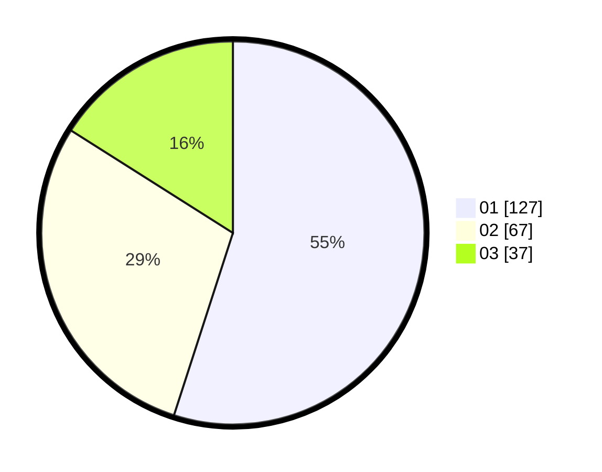

# Hasil

Hasil perolehan suara paslon dapat dilihat pada file paslon-01.txt, paslon-02.txt, dan paslon-03.txt.

Jika tidak ada, artinya data tersebut belum ada pada SIREKAP.

## Perolehan Suara

 * Paslon 01: **127**.
 * Paslon 02: **67**.
 * Paslon 03: **37**.

## Foto C Plano

https://sirekap-obj-formc.kpu.go.id/566b/pemilu/ppwp/31/73/05/10/03/3173051003088-20240214-195733--a44e76c1-b1e1-4469-b68b-cf5032084a9c.jpg

https://sirekap-obj-formc.kpu.go.id/566b/pemilu/ppwp/31/73/05/10/03/3173051003088-20240214-195855--0c368302-d685-41f6-957c-dfff161e8453.jpg

https://sirekap-obj-formc.kpu.go.id/566b/pemilu/ppwp/31/73/05/10/03/3173051003088-20240214-200110--d2bb309e-5eba-4d19-9c74-19e94a49285c.jpg

## DATA PEMILIH TETAP

Jumlah pemilih dalam DPT: **282**.
 * L: **131**.
 * P: **151**.

## DATA PENGGUNA HAK PILIH

Jumlah pengguna hak pilih dalam DPT: **221**.
 * L: **97**.
 * P: **124**.

Jumlah pengguna hak pilih dalam DPTb: **6**.
 * L: **3**.
 * P: **3**.

Jumlah pengguna hak pilih dalam DPK: **6**.
 * L: **3**.
 * P: **3**.

Jumlah pengguna hak pilih: **233**.
 * L: **103**.
 * P: **130**.

## JUMLAH SUARA SAH DAN TIDAK SAH

JUMLAH SELURUH SUARA SAH: **231**.

JUMLAH SUARA TIDAK SAH: **2**.

JUMLAH SELURUH SUARA SAH DAN SUARA TIDAK SAH: **233**.
