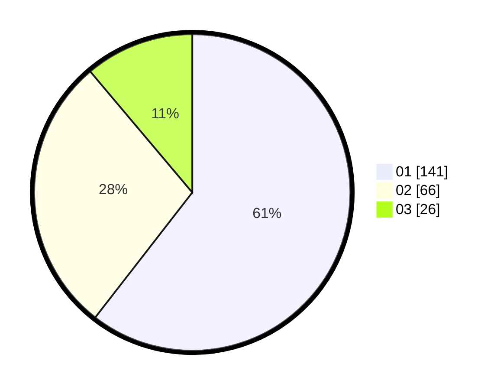

# Hasil

Hasil perolehan suara paslon dapat dilihat pada file paslon-01.txt, paslon-02.txt, dan paslon-03.txt.

Jika tidak ada, artinya data tersebut belum ada pada SIREKAP.

## Perolehan Suara

 * Paslon 01: **141**.
 * Paslon 02: **66**.
 * Paslon 03: **26**.

## Foto C Plano

https://sirekap-obj-formc.kpu.go.id/af77/pemilu/ppwp/31/73/05/10/03/3173051003090-20240216-114408--ab10863f-a234-4a7e-9f9e-7e5fabb7d4a5.jpg

https://sirekap-obj-formc.kpu.go.id/af77/pemilu/ppwp/31/73/05/10/03/3173051003090-20240216-065713--c148e490-c875-46fa-a766-5ee85d4fdfd1.jpg

https://sirekap-obj-formc.kpu.go.id/af77/pemilu/ppwp/31/73/05/10/03/3173051003090-20240216-065709--90eeba75-a5d9-4457-837f-28eb66b13909.jpg

## DATA PEMILIH TETAP

Jumlah pemilih dalam DPT: **277**.
 * L: **143**.
 * P: **134**.

## DATA PENGGUNA HAK PILIH

Jumlah pengguna hak pilih dalam DPT: **223**.
 * L: **108**.
 * P: **115**.

Jumlah pengguna hak pilih dalam DPTb: **4**.
 * L: **2**.
 * P: **2**.

Jumlah pengguna hak pilih dalam DPK: **8**.
 * L: **3**.
 * P: **5**.

Jumlah pengguna hak pilih: **235**.
 * L: **113**.
 * P: **122**.

## JUMLAH SUARA SAH DAN TIDAK SAH

JUMLAH SELURUH SUARA SAH: **233**.

JUMLAH SUARA TIDAK SAH: **2**.

JUMLAH SELURUH SUARA SAH DAN SUARA TIDAK SAH: **235**.
