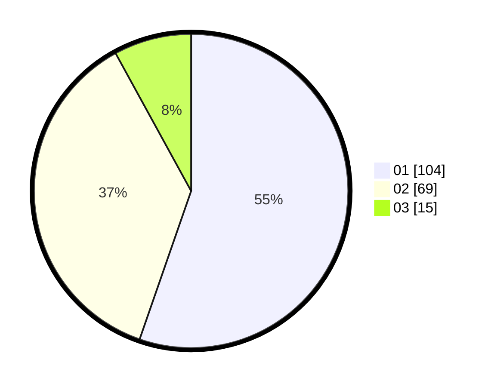

# Hasil

Hasil perolehan suara paslon dapat dilihat pada file paslon-01.txt, paslon-02.txt, dan paslon-03.txt.

Jika tidak ada, artinya data tersebut belum ada pada SIREKAP.

## Perolehan Suara

 * Paslon 01: **104**.
 * Paslon 02: **69**.
 * Paslon 03: **15**.

## Foto C Plano

https://sirekap-obj-formc.kpu.go.id/eba9/pemilu/ppwp/31/73/05/10/03/3173051003104-20240214-195850--c878b581-4c33-403d-b4be-6c0841764e04.jpg

https://sirekap-obj-formc.kpu.go.id/eba9/pemilu/ppwp/31/73/05/10/03/3173051003104-20240214-200124--4c6e8358-02c5-44b9-9baf-9694b0423092.jpg

https://sirekap-obj-formc.kpu.go.id/eba9/pemilu/ppwp/31/73/05/10/03/3173051003104-20240214-200238--f15c3bbb-3153-4832-87ec-3fe119e097c8.jpg

## DATA PEMILIH TETAP

Jumlah pemilih dalam DPT: **258**.
 * L: **134**.
 * P: **124**.

## DATA PENGGUNA HAK PILIH

Jumlah pengguna hak pilih dalam DPT: **184**.
 * L: **95**.
 * P: **89**.

Jumlah pengguna hak pilih dalam DPTb: **0**.
 * L: **0**.
 * P: **0**.

Jumlah pengguna hak pilih dalam DPK: **6**.
 * L: **3**.
 * P: **3**.

Jumlah pengguna hak pilih: **190**.
 * L: **98**.
 * P: **92**.

## JUMLAH SUARA SAH DAN TIDAK SAH

JUMLAH SELURUH SUARA SAH: **188**.

JUMLAH SUARA TIDAK SAH: **2**.

JUMLAH SELURUH SUARA SAH DAN SUARA TIDAK SAH: **190**.
