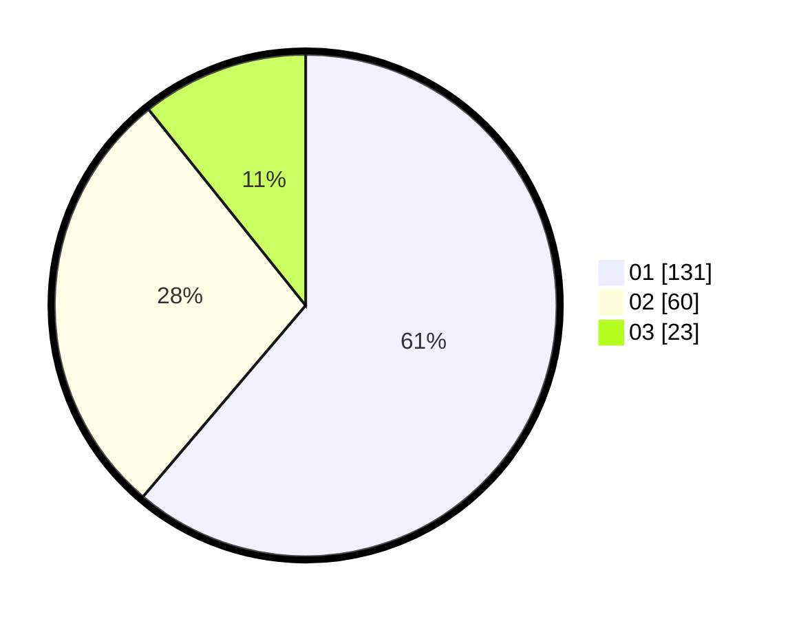

# Hasil

Hasil perolehan suara paslon dapat dilihat pada file paslon-01.txt, paslon-02.txt, dan paslon-03.txt.

Jika tidak ada, artinya data tersebut belum ada pada SIREKAP.

## Perolehan Suara

 * Paslon 01: **131**.
 * Paslon 02: **60**.
 * Paslon 03: **23**.

## Foto C Plano

https://sirekap-obj-formc.kpu.go.id/d882/pemilu/ppwp/31/73/05/10/03/3173051003108-20240214-202053--fd81f4bc-567e-4fd1-bf4e-19d1effb5eeb.jpg

https://sirekap-obj-formc.kpu.go.id/d882/pemilu/ppwp/31/73/05/10/03/3173051003108-20240214-202059--f5c6257f-537a-4304-ab54-844ca90eb69a.jpg

https://sirekap-obj-formc.kpu.go.id/d882/pemilu/ppwp/31/73/05/10/03/3173051003108-20240214-212536--15565ee3-ca52-4f6c-b93c-927892825470.jpg
