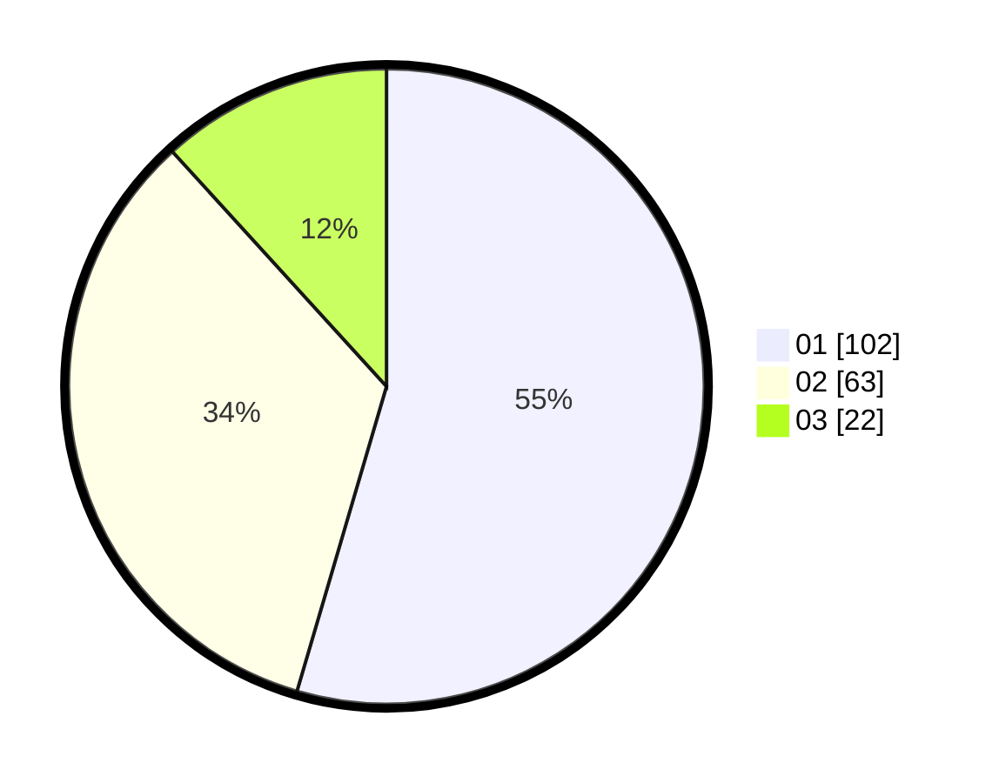

# Hasil

Hasil perolehan suara paslon dapat dilihat pada file paslon-01.txt, paslon-02.txt, dan paslon-03.txt.

Jika tidak ada, artinya data tersebut belum ada pada SIREKAP.

## Perolehan Suara

 * Paslon 01: **102**.
 * Paslon 02: **63**.
 * Paslon 03: **22**.

## Foto C Plano

https://sirekap-obj-formc.kpu.go.id/0d9a/pemilu/ppwp/31/73/05/10/03/3173051003109-20240214-225732--a1ba8faa-c7dc-4e3a-b070-413354cba1c8.jpg

https://sirekap-obj-formc.kpu.go.id/0d9a/pemilu/ppwp/31/73/05/10/03/3173051003109-20240214-230102--183ee2c3-fb69-4c79-9692-b17ca5336e1c.jpg

https://sirekap-obj-formc.kpu.go.id/0d9a/pemilu/ppwp/31/73/05/10/03/3173051003109-20240214-230234--1fd7548f-1536-479d-8bf6-e4ea0c5f6123.jpg
