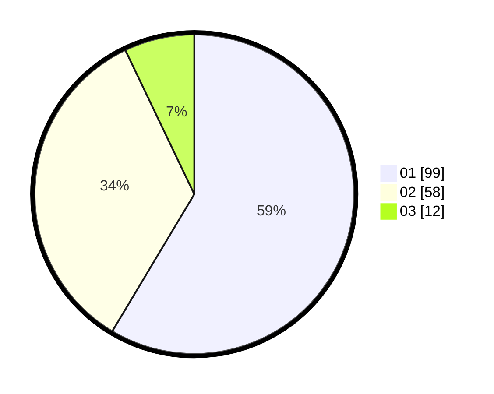

# Hasil

Hasil perolehan suara paslon dapat dilihat pada file paslon-01.txt, paslon-02.txt, dan paslon-03.txt.

Jika tidak ada, artinya data tersebut belum ada pada SIREKAP.

## Perolehan Suara

 * Paslon 01: **99**.
 * Paslon 02: **58**.
 * Paslon 03: **12**.

## Foto C Plano

https://sirekap-obj-formc.kpu.go.id/bc22/pemilu/ppwp/31/73/05/10/03/3173051003116-20240215-004000--baa19a1c-fc55-4af8-bebb-020296c7b7c7.jpg

https://sirekap-obj-formc.kpu.go.id/bc22/pemilu/ppwp/31/73/05/10/03/3173051003116-20240215-004049--6d2accbc-13b4-46fe-9b31-93f6eab04697.jpg

https://sirekap-obj-formc.kpu.go.id/bc22/pemilu/ppwp/31/73/05/10/03/3173051003116-20240215-004144--c1f0179b-fe92-4f3b-93a8-763b5dd1ce33.jpg
