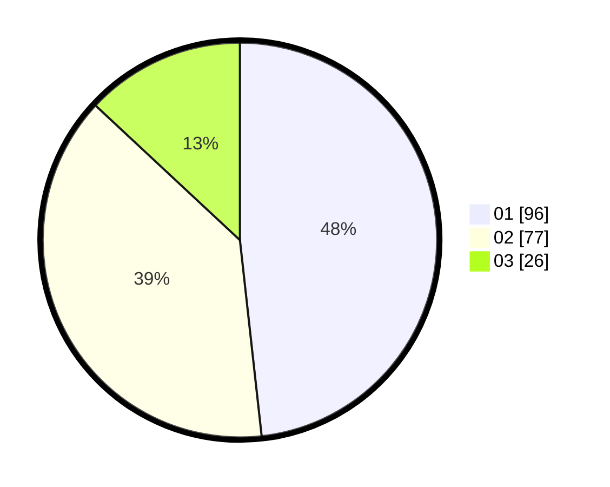

# Hasil

Hasil perolehan suara paslon dapat dilihat pada file paslon-01.txt, paslon-02.txt, dan paslon-03.txt.

Jika tidak ada, artinya data tersebut belum ada pada SIREKAP.

## Perolehan Suara

 * Paslon 01: **96**.
 * Paslon 02: **77**.
 * Paslon 03: **26**.

## Foto C Plano

https://sirekap-obj-formc.kpu.go.id/b47c/pemilu/ppwp/31/73/05/10/03/3173051003121-20240215-012424--d510c3ca-5027-4489-a7a5-d6a68829cd70.jpg

https://sirekap-obj-formc.kpu.go.id/b47c/pemilu/ppwp/31/73/05/10/03/3173051003121-20240215-013057--05c62da6-c915-40d0-88b0-293359f74dce.jpg

https://sirekap-obj-formc.kpu.go.id/b47c/pemilu/ppwp/31/73/05/10/03/3173051003121-20240215-013141--2642bf39-33fd-4099-bf88-2ed704ee68f3.jpg
