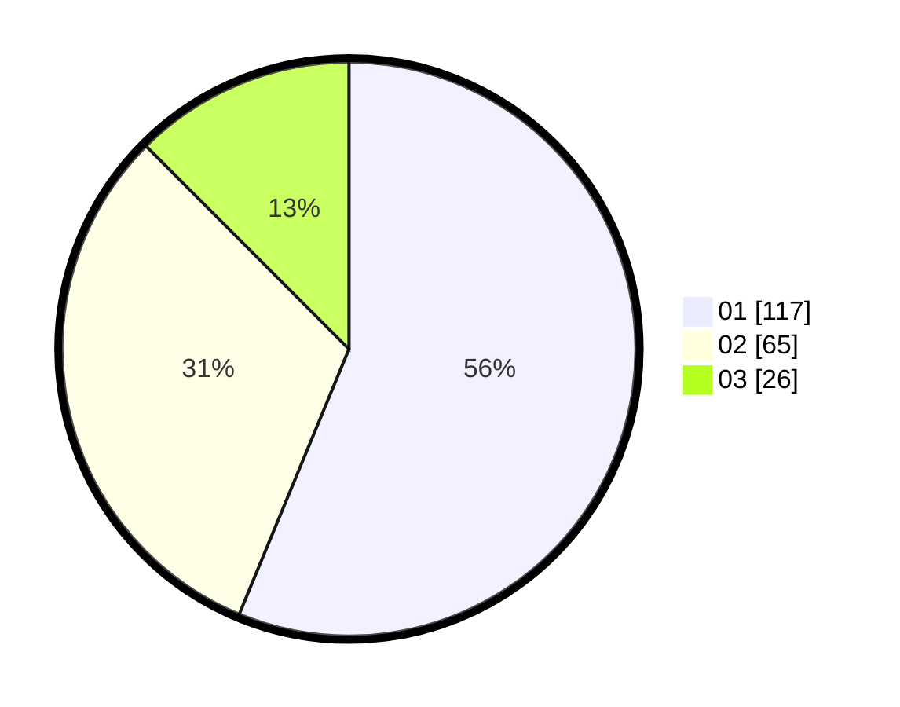

# Hasil

Hasil perolehan suara paslon dapat dilihat pada file paslon-01.txt, paslon-02.txt, dan paslon-03.txt.

Jika tidak ada, artinya data tersebut belum ada pada SIREKAP.

## Perolehan Suara

 * Paslon 01: **117**.
 * Paslon 02: **65**.
 * Paslon 03: **26**.

## Foto C Plano

https://sirekap-obj-formc.kpu.go.id/2e7c/pemilu/ppwp/31/73/05/10/03/3173051003126-20240214-185010--58cf38f4-846a-4c00-ac08-9e35a396b756.jpg

https://sirekap-obj-formc.kpu.go.id/2e7c/pemilu/ppwp/31/73/05/10/03/3173051003126-20240214-185348--8525a928-aacd-457a-93bf-41a3a18758f4.jpg

https://sirekap-obj-formc.kpu.go.id/2e7c/pemilu/ppwp/31/73/05/10/03/3173051003126-20240214-185642--133bdf5e-4499-4106-ace7-68871c39cc83.jpg

## DATA PEMILIH TETAP

Jumlah pemilih dalam DPT: **292**.
 * L: **149**.
 * P: **143**.

## DATA PENGGUNA HAK PILIH

Jumlah pengguna hak pilih dalam DPT: **206**.
 * L: **99**.
 * P: **107**.

Jumlah pengguna hak pilih dalam DPTb: **3**.
 * L: **1**.
 * P: **2**.

Jumlah pengguna hak pilih dalam DPK: **1**.
 * L: **0**.
 * P: **1**.

Jumlah pengguna hak pilih: **210**.
 * L: **100**.
 * P: **110**.

## JUMLAH SUARA SAH DAN TIDAK SAH

JUMLAH SELURUH SUARA SAH: **208**.

JUMLAH SUARA TIDAK SAH: **2**.

JUMLAH SELURUH SUARA SAH DAN SUARA TIDAK SAH: **210**.
