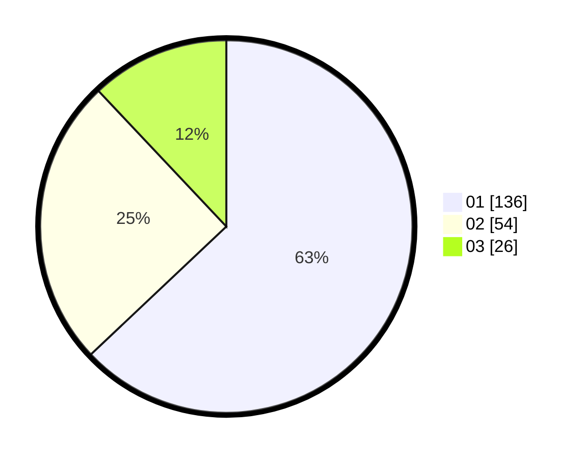

# Hasil

Hasil perolehan suara paslon dapat dilihat pada file paslon-01.txt, paslon-02.txt, dan paslon-03.txt.

Jika tidak ada, artinya data tersebut belum ada pada SIREKAP.

## Perolehan Suara

 * Paslon 01: **136**.
 * Paslon 02: **54**.
 * Paslon 03: **26**.

## Foto C Plano

https://sirekap-obj-formc.kpu.go.id/6277/pemilu/ppwp/31/73/05/10/04/3173051004001-20240215-001708--87f2b9c3-9fd3-4649-83ea-9e8741ff8af0.jpg

https://sirekap-obj-formc.kpu.go.id/6277/pemilu/ppwp/31/73/05/10/04/3173051004001-20240215-001652--32da720f-96da-4873-9dfa-11bc3abc320c.jpg

https://sirekap-obj-formc.kpu.go.id/6277/pemilu/ppwp/31/73/05/10/04/3173051004001-20240215-001454--9941c655-3de4-4725-bf43-d0000ee5805d.jpg
