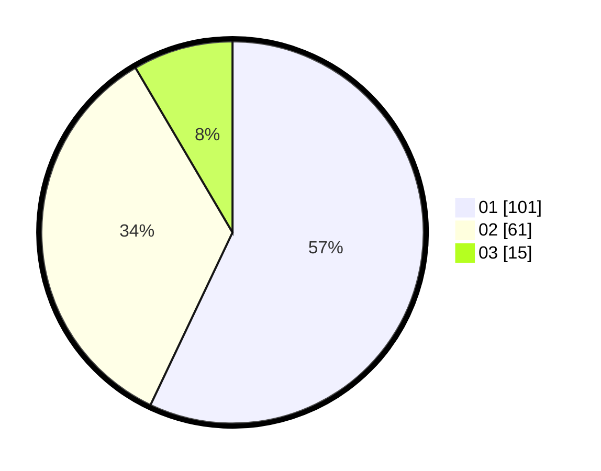

# Hasil

Hasil perolehan suara paslon dapat dilihat pada file paslon-01.txt, paslon-02.txt, dan paslon-03.txt.

Jika tidak ada, artinya data tersebut belum ada pada SIREKAP.

## Perolehan Suara

 * Paslon 01: **101**.
 * Paslon 02: **61**.
 * Paslon 03: **15**.

## Foto C Plano

https://sirekap-obj-formc.kpu.go.id/6104/pemilu/ppwp/31/73/05/10/04/3173051004002-20240216-165417--73f4504c-9bf5-4c97-8056-6c5db98d23f8.jpg

https://sirekap-obj-formc.kpu.go.id/6104/pemilu/ppwp/31/73/05/10/04/3173051004002-20240216-165456--a41adced-da16-4efc-b34d-c69d77d79d9c.jpg

https://sirekap-obj-formc.kpu.go.id/6104/pemilu/ppwp/31/73/05/10/04/3173051004002-20240216-165531--d0ca84f1-49f4-4d1c-9f3e-6c46e87189b9.jpg

## DATA PEMILIH TETAP

Jumlah pemilih dalam DPT: **228**.
 * L: **116**.
 * P: **112**.

## DATA PENGGUNA HAK PILIH

Jumlah pengguna hak pilih dalam DPT: **177**.
 * L: **86**.
 * P: **91**.

Jumlah pengguna hak pilih dalam DPTb: **3**.
 * L: **1**.
 * P: **2**.

Jumlah pengguna hak pilih dalam DPK: **2**.
 * L: **0**.
 * P: **2**.

Jumlah pengguna hak pilih: **182**.
 * L: **87**.
 * P: **95**.

## JUMLAH SUARA SAH DAN TIDAK SAH

JUMLAH SELURUH SUARA SAH: **177**.

JUMLAH SUARA TIDAK SAH: **5**.

JUMLAH SELURUH SUARA SAH DAN SUARA TIDAK SAH: **182**.
