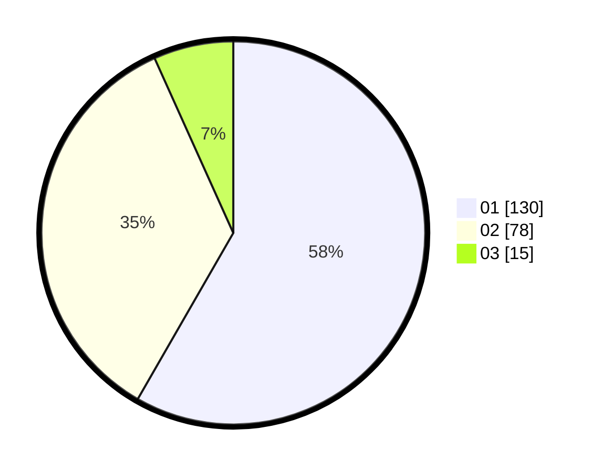

# Hasil

Hasil perolehan suara paslon dapat dilihat pada file paslon-01.txt, paslon-02.txt, dan paslon-03.txt.

Jika tidak ada, artinya data tersebut belum ada pada SIREKAP.

## Perolehan Suara

 * Paslon 01: **130**.
 * Paslon 02: **78**.
 * Paslon 03: **15**.

## Foto C Plano

https://sirekap-obj-formc.kpu.go.id/3a6e/pemilu/ppwp/31/73/05/10/04/3173051004005-20240214-213423--eacaa088-4eab-4e08-986a-c448241cb65b.jpg

https://sirekap-obj-formc.kpu.go.id/3a6e/pemilu/ppwp/31/73/05/10/04/3173051004005-20240214-213531--210a0ccd-fe16-457b-8617-189b5bea2c5b.jpg

https://sirekap-obj-formc.kpu.go.id/3a6e/pemilu/ppwp/31/73/05/10/04/3173051004005-20240214-213628--59fbe277-2529-467c-a32e-bba6fd924df0.jpg

## DATA PEMILIH TETAP

Jumlah pemilih dalam DPT: **285**.
 * L: **135**.
 * P: **150**.

## DATA PENGGUNA HAK PILIH

Jumlah pengguna hak pilih dalam DPT: **222**.
 * L: **105**.
 * P: **117**.

Jumlah pengguna hak pilih dalam DPTb: **2**.
 * L: **1**.
 * P: **1**.

Jumlah pengguna hak pilih dalam DPK: **0**.
 * L: **0**.
 * P: **0**.

Jumlah pengguna hak pilih: **224**.
 * L: **106**.
 * P: **118**.

## JUMLAH SUARA SAH DAN TIDAK SAH

JUMLAH SELURUH SUARA SAH: **223**.

JUMLAH SUARA TIDAK SAH: **1**.

JUMLAH SELURUH SUARA SAH DAN SUARA TIDAK SAH: **224**.
