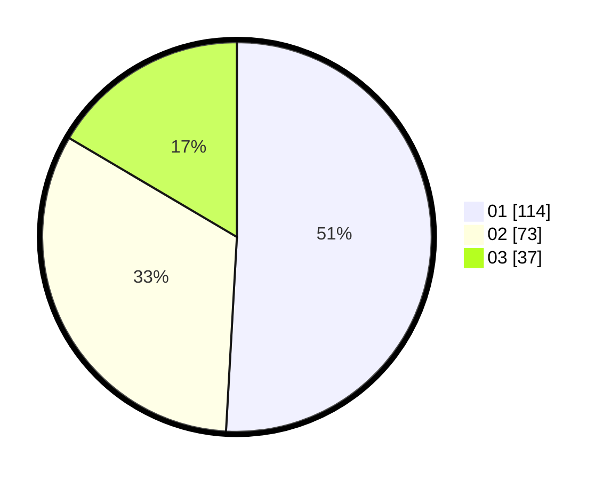

# Hasil

Hasil perolehan suara paslon dapat dilihat pada file paslon-01.txt, paslon-02.txt, dan paslon-03.txt.

Jika tidak ada, artinya data tersebut belum ada pada SIREKAP.

## Perolehan Suara

 * Paslon 01: **114**.
 * Paslon 02: **73**.
 * Paslon 03: **37**.

## Foto C Plano

https://sirekap-obj-formc.kpu.go.id/8564/pemilu/ppwp/31/73/05/10/04/3173051004006-20240215-015247--bfbe1528-5e07-4d53-8235-5d4e37cc3d02.jpg

https://sirekap-obj-formc.kpu.go.id/8564/pemilu/ppwp/31/73/05/10/04/3173051004006-20240215-024611--d9825ed6-2c0e-4152-ba0c-40a7d388e1ab.jpg

https://sirekap-obj-formc.kpu.go.id/8564/pemilu/ppwp/31/73/05/10/04/3173051004006-20240215-024655--67b08514-4bcb-4e56-96cd-4c1d1f562cbc.jpg
