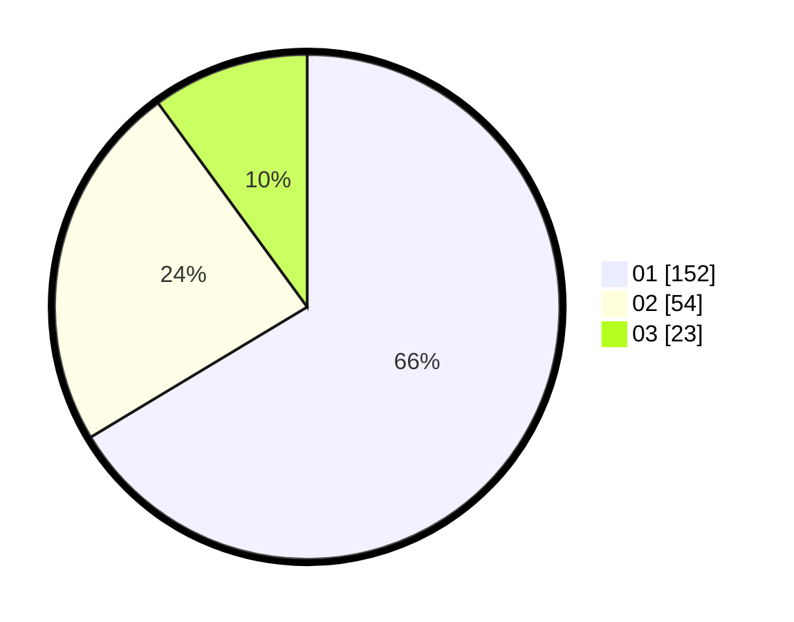

# Hasil

Hasil perolehan suara paslon dapat dilihat pada file paslon-01.txt, paslon-02.txt, dan paslon-03.txt.

Jika tidak ada, artinya data tersebut belum ada pada SIREKAP.

## Perolehan Suara

 * Paslon 01: **152**.
 * Paslon 02: **54**.
 * Paslon 03: **23**.

## Foto C Plano

https://sirekap-obj-formc.kpu.go.id/5676/pemilu/ppwp/31/73/05/10/04/3173051004007-20240214-220514--60d21b52-b331-4173-ac02-9b0ca6caadb4.jpg

https://sirekap-obj-formc.kpu.go.id/5676/pemilu/ppwp/31/73/05/10/04/3173051004007-20240214-220852--229a2d2d-001b-43ba-b8ee-542e545cc741.jpg

https://sirekap-obj-formc.kpu.go.id/5676/pemilu/ppwp/31/73/05/10/04/3173051004007-20240214-221039--572d1f9a-ac16-471a-a219-b9bfd587fb58.jpg
