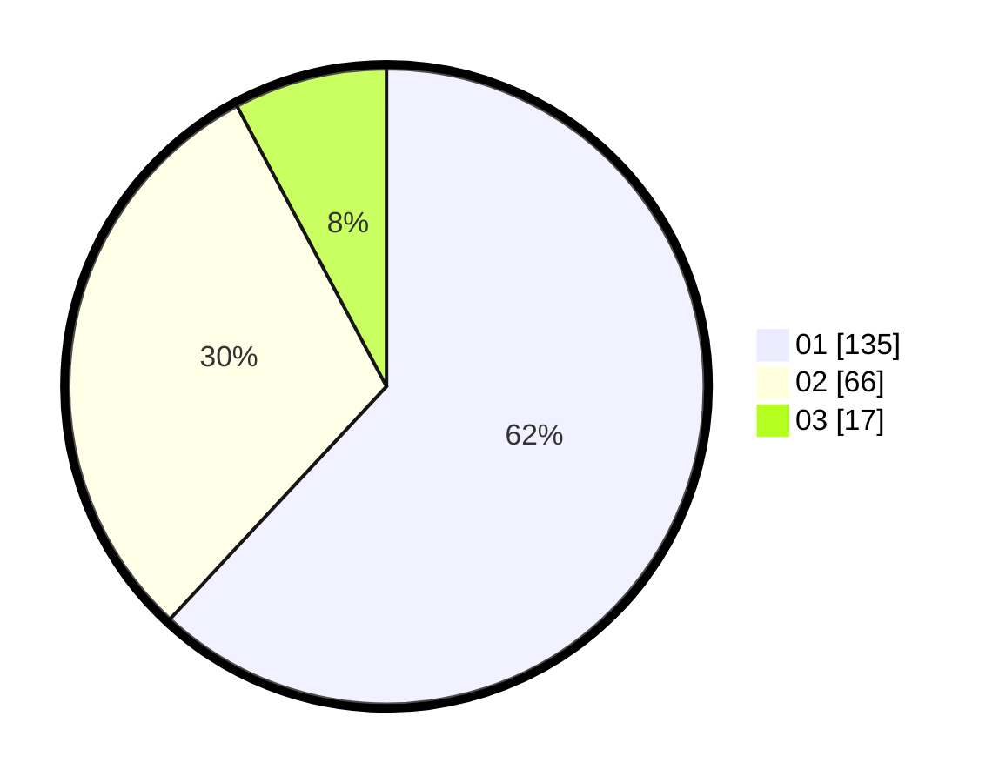

# Hasil

Hasil perolehan suara paslon dapat dilihat pada file paslon-01.txt, paslon-02.txt, dan paslon-03.txt.

Jika tidak ada, artinya data tersebut belum ada pada SIREKAP.

## Perolehan Suara

 * Paslon 01: **135**.
 * Paslon 02: **66**.
 * Paslon 03: **17**.

## Foto C Plano

https://sirekap-obj-formc.kpu.go.id/8090/pemilu/ppwp/31/73/05/10/04/3173051004011-20240214-220213--7ffadf30-4fe8-48fd-a3bf-aae2c1fd0d82.jpg

https://sirekap-obj-formc.kpu.go.id/8090/pemilu/ppwp/31/73/05/10/04/3173051004011-20240214-220313--618a98ec-0e16-4a9e-96f5-076b9f986e7a.jpg

https://sirekap-obj-formc.kpu.go.id/8090/pemilu/ppwp/31/73/05/10/04/3173051004011-20240214-225750--0bc83dde-175c-416b-a412-f2b81b378432.jpg

## DATA PEMILIH TETAP

Jumlah pemilih dalam DPT: **259**.
 * L: **125**.
 * P: **134**.

## DATA PENGGUNA HAK PILIH

Jumlah pengguna hak pilih dalam DPT: **215**.
 * L: **104**.
 * P: **111**.

Jumlah pengguna hak pilih dalam DPTb: **2**.
 * L: **0**.
 * P: **2**.

Jumlah pengguna hak pilih dalam DPK: **1**.
 * L: **1**.
 * P: **0**.

Jumlah pengguna hak pilih: **218**.
 * L: **105**.
 * P: **113**.

## JUMLAH SUARA SAH DAN TIDAK SAH

JUMLAH SELURUH SUARA SAH: **218**.

JUMLAH SUARA TIDAK SAH: **0**.

JUMLAH SELURUH SUARA SAH DAN SUARA TIDAK SAH: **218**.
