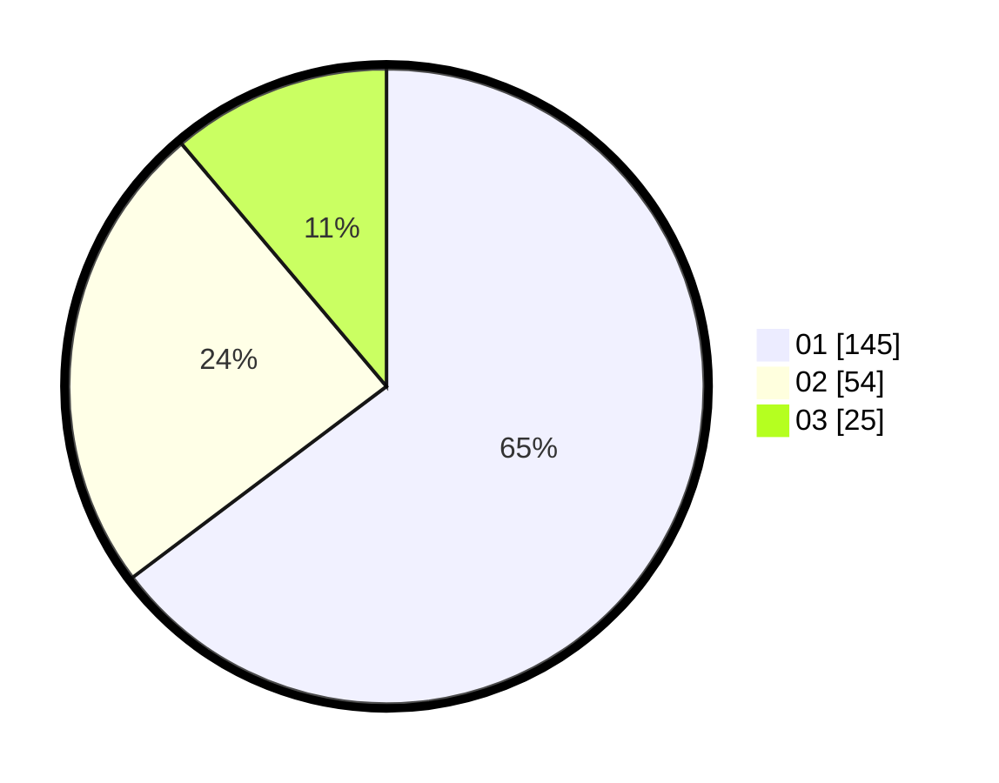

# Hasil

Hasil perolehan suara paslon dapat dilihat pada file paslon-01.txt, paslon-02.txt, dan paslon-03.txt.

Jika tidak ada, artinya data tersebut belum ada pada SIREKAP.

## Perolehan Suara

 * Paslon 01: **145**.
 * Paslon 02: **54**.
 * Paslon 03: **25**.

## Foto C Plano

https://sirekap-obj-formc.kpu.go.id/7960/pemilu/ppwp/31/73/05/10/04/3173051004013-20240215-012513--e962ec53-d0aa-43e4-abd7-10f766e4d18b.jpg

https://sirekap-obj-formc.kpu.go.id/7960/pemilu/ppwp/31/73/05/10/04/3173051004013-20240215-012336--804f9180-7293-4139-8a5b-0c9441efe16e.jpg
