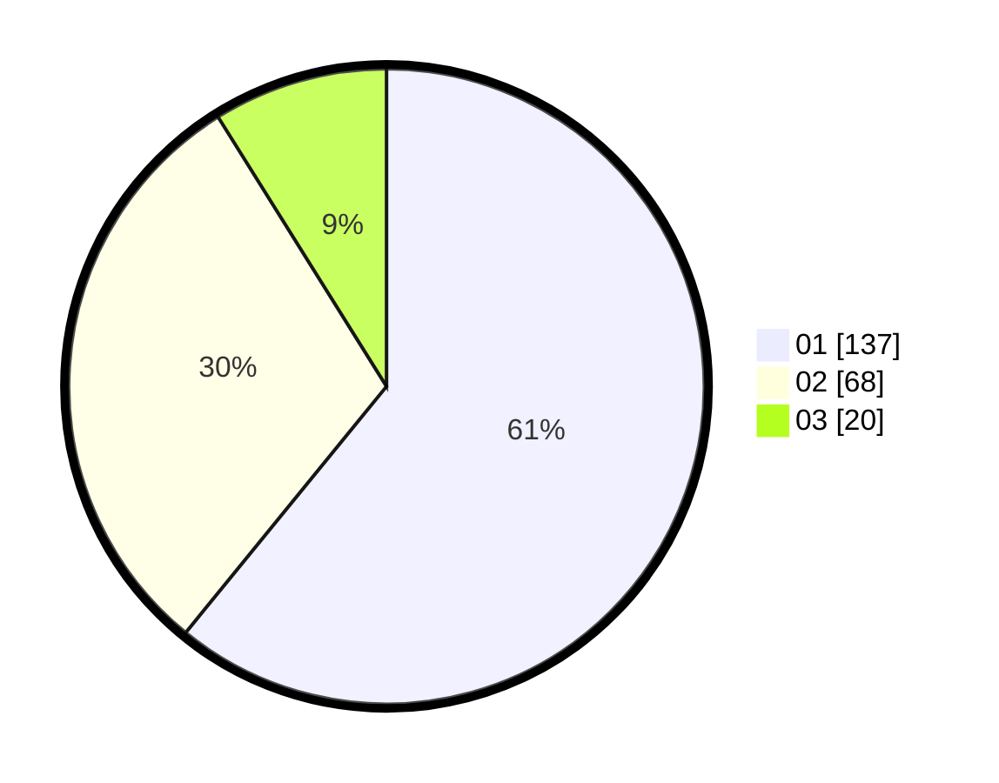

# Hasil

Hasil perolehan suara paslon dapat dilihat pada file paslon-01.txt, paslon-02.txt, dan paslon-03.txt.

Jika tidak ada, artinya data tersebut belum ada pada SIREKAP.

## Perolehan Suara

 * Paslon 01: **137**.
 * Paslon 02: **68**.
 * Paslon 03: **20**.

## Foto C Plano

https://sirekap-obj-formc.kpu.go.id/fca5/pemilu/ppwp/31/73/05/10/04/3173051004014-20240215-114849--763b37c3-3d56-49f1-be45-610583f28ba7.jpg

https://sirekap-obj-formc.kpu.go.id/fca5/pemilu/ppwp/31/73/05/10/04/3173051004014-20240215-114854--e8b840a6-8246-471d-94ea-79a57d0173c1.jpg

https://sirekap-obj-formc.kpu.go.id/fca5/pemilu/ppwp/31/73/05/10/04/3173051004014-20240215-114858--c0838f8f-74de-4e5d-aba9-0c88b4cc553f.jpg
