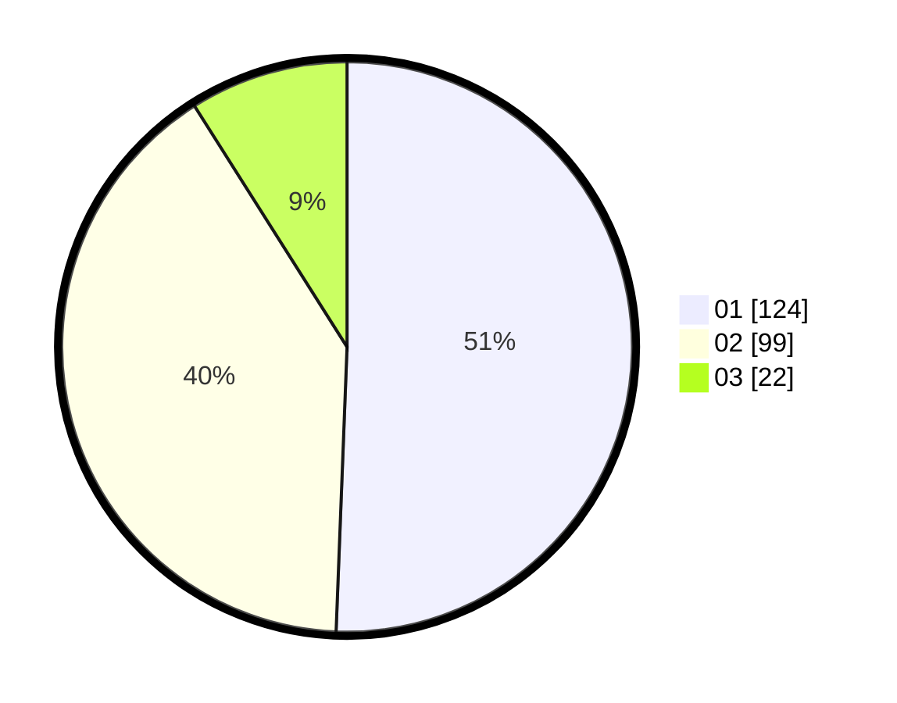

# Hasil

Hasil perolehan suara paslon dapat dilihat pada file paslon-01.txt, paslon-02.txt, dan paslon-03.txt.

Jika tidak ada, artinya data tersebut belum ada pada SIREKAP.

## Perolehan Suara

 * Paslon 01: **124**.
 * Paslon 02: **99**.
 * Paslon 03: **22**.

## Foto C Plano

https://sirekap-obj-formc.kpu.go.id/dd12/pemilu/ppwp/31/73/05/10/04/3173051004016-20240214-225314--23a392da-e12b-431d-80ee-399f978bc03a.jpg

https://sirekap-obj-formc.kpu.go.id/dd12/pemilu/ppwp/31/73/05/10/04/3173051004016-20240214-225441--ddebede5-0a6b-45d9-8ff8-2580cdd29c05.jpg

https://sirekap-obj-formc.kpu.go.id/dd12/pemilu/ppwp/31/73/05/10/04/3173051004016-20240214-225553--11e07723-2e4f-4f56-858d-9efd381bdab7.jpg
