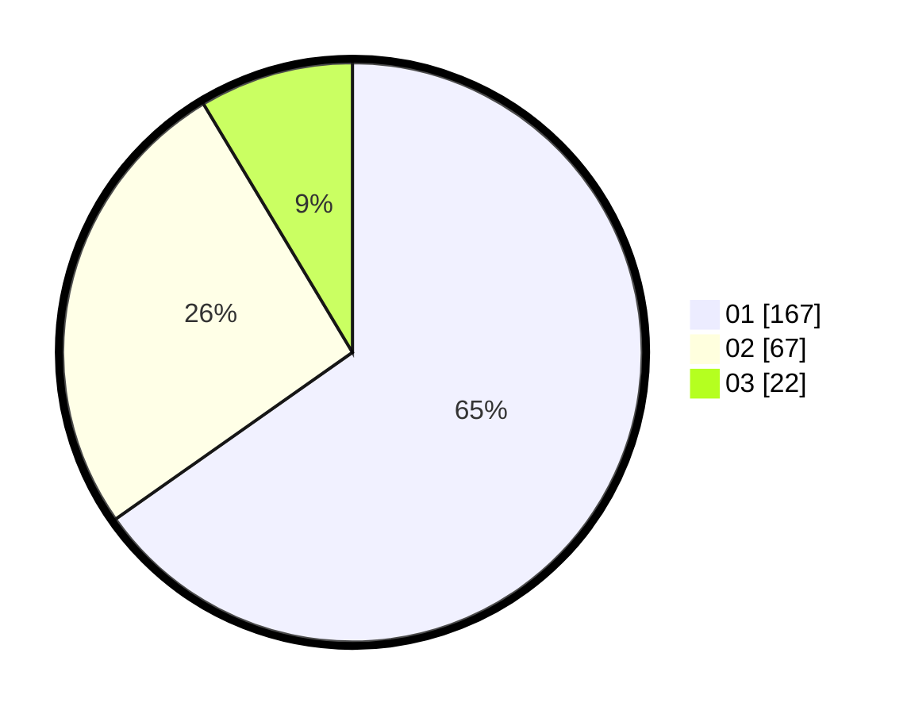

# Hasil

Hasil perolehan suara paslon dapat dilihat pada file paslon-01.txt, paslon-02.txt, dan paslon-03.txt.

Jika tidak ada, artinya data tersebut belum ada pada SIREKAP.

## Perolehan Suara

 * Paslon 01: **167**.
 * Paslon 02: **67**.
 * Paslon 03: **22**.

## Foto C Plano

https://sirekap-obj-formc.kpu.go.id/8b91/pemilu/ppwp/31/73/05/10/04/3173051004025-20240214-234041--8fdcf233-529c-45d7-892c-142837b9fc9d.jpg

https://sirekap-obj-formc.kpu.go.id/8b91/pemilu/ppwp/31/73/05/10/04/3173051004025-20240214-234210--e4a4e383-d347-47a1-98b4-aa4d17c74b3d.jpg

https://sirekap-obj-formc.kpu.go.id/8b91/pemilu/ppwp/31/73/05/10/04/3173051004025-20240214-234335--2b4bfb71-da2a-4de1-ae89-f6e32a452574.jpg
