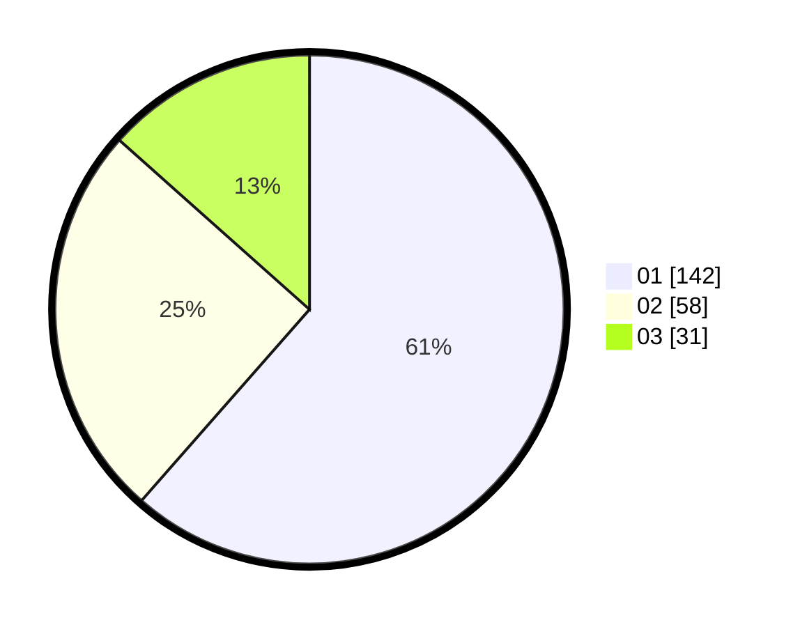

# Hasil

Hasil perolehan suara paslon dapat dilihat pada file paslon-01.txt, paslon-02.txt, dan paslon-03.txt.

Jika tidak ada, artinya data tersebut belum ada pada SIREKAP.

## Perolehan Suara

 * Paslon 01: **142**.
 * Paslon 02: **58**.
 * Paslon 03: **31**.

## Foto C Plano

https://sirekap-obj-formc.kpu.go.id/a40f/pemilu/ppwp/31/73/05/10/04/3173051004026-20240214-214020--8045cd94-344b-4936-8633-8c1b34441067.jpg

https://sirekap-obj-formc.kpu.go.id/a40f/pemilu/ppwp/31/73/05/10/04/3173051004026-20240214-213227--58c73359-a1f3-4028-9296-03dc9a8338a8.jpg

https://sirekap-obj-formc.kpu.go.id/a40f/pemilu/ppwp/31/73/05/10/04/3173051004026-20240214-213300--427b0ac9-357a-42b6-b712-e8182de69f3d.jpg
