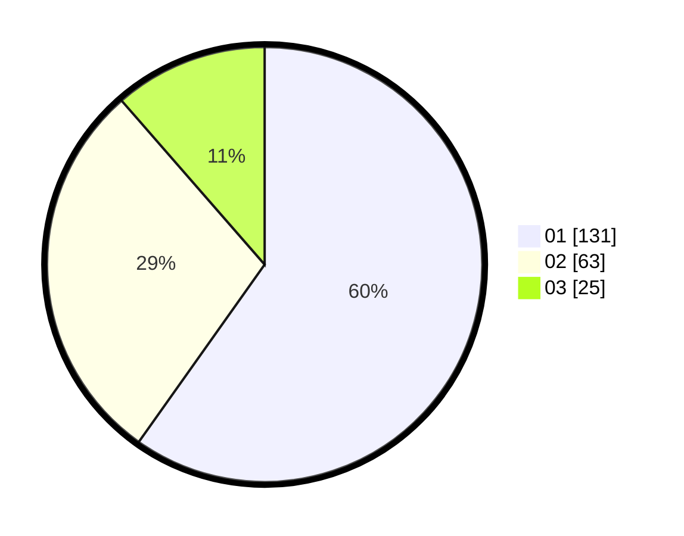

# Hasil

Hasil perolehan suara paslon dapat dilihat pada file paslon-01.txt, paslon-02.txt, dan paslon-03.txt.

Jika tidak ada, artinya data tersebut belum ada pada SIREKAP.

## Perolehan Suara

 * Paslon 01: **131**.
 * Paslon 02: **63**.
 * Paslon 03: **25**.

## Foto C Plano

https://sirekap-obj-formc.kpu.go.id/90a7/pemilu/ppwp/31/73/05/10/04/3173051004027-20240214-232838--bd857299-e839-47f3-9d51-5b414b8899f7.jpg

https://sirekap-obj-formc.kpu.go.id/90a7/pemilu/ppwp/31/73/05/10/04/3173051004027-20240214-233725--a1079222-cd75-4a18-9586-bd590b90d93b.jpg

https://sirekap-obj-formc.kpu.go.id/90a7/pemilu/ppwp/31/73/05/10/04/3173051004027-20240214-233921--9417ff4b-75a1-4bc5-8122-60240e78435d.jpg

## DATA PEMILIH TETAP

Jumlah pemilih dalam DPT: **259**.
 * L: **130**.
 * P: **129**.

## DATA PENGGUNA HAK PILIH

Jumlah pengguna hak pilih dalam DPT: **207**.
 * L: **103**.
 * P: **104**.

Jumlah pengguna hak pilih dalam DPTb: **11**.
 * L: **6**.
 * P: **5**.

Jumlah pengguna hak pilih dalam DPK: **1**.
 * L: **1**.
 * P: **0**.

Jumlah pengguna hak pilih: **219**.
 * L: **110**.
 * P: **109**.

## JUMLAH SUARA SAH DAN TIDAK SAH

JUMLAH SELURUH SUARA SAH: **219**.

JUMLAH SUARA TIDAK SAH: **0**.

JUMLAH SELURUH SUARA SAH DAN SUARA TIDAK SAH: **219**.
