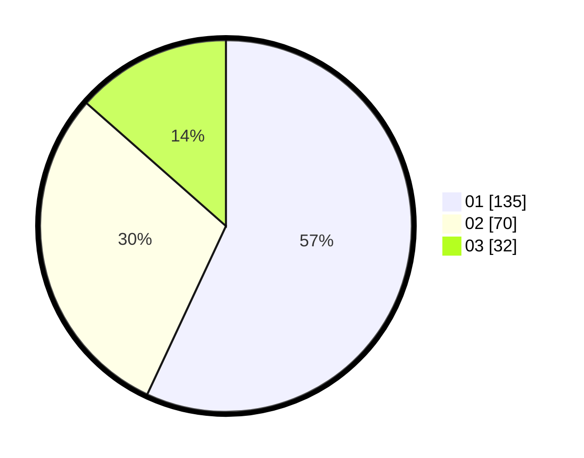

# Hasil

Hasil perolehan suara paslon dapat dilihat pada file paslon-01.txt, paslon-02.txt, dan paslon-03.txt.

Jika tidak ada, artinya data tersebut belum ada pada SIREKAP.

## Perolehan Suara

 * Paslon 01: **135**.
 * Paslon 02: **70**.
 * Paslon 03: **32**.

## Foto C Plano

https://sirekap-obj-formc.kpu.go.id/0b32/pemilu/ppwp/31/73/05/10/04/3173051004039-20240214-233535--281596f6-6abd-4026-9d7c-da497ce1de4a.jpg

https://sirekap-obj-formc.kpu.go.id/0b32/pemilu/ppwp/31/73/05/10/04/3173051004039-20240214-233541--f379b7dd-67bc-48a6-b466-ce629ab0c76f.jpg

https://sirekap-obj-formc.kpu.go.id/0b32/pemilu/ppwp/31/73/05/10/04/3173051004039-20240214-233932--cf90a6ff-676b-469c-88c7-96d8406ea5ab.jpg
