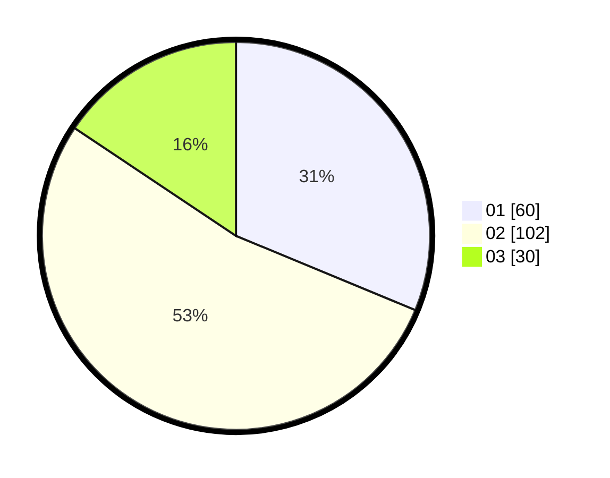

# Hasil

Hasil perolehan suara paslon dapat dilihat pada file paslon-01.txt, paslon-02.txt, dan paslon-03.txt.

Jika tidak ada, artinya data tersebut belum ada pada SIREKAP.

## Perolehan Suara

 * Paslon 01: **60**.
 * Paslon 02: **102**.
 * Paslon 03: **30**.

## Foto C Plano

https://sirekap-obj-formc.kpu.go.id/9ca7/pemilu/ppwp/31/73/05/10/04/3173051004042-20240215-012947--e7de6c81-9045-4ad0-afa9-adb03827f7ea.jpg

https://sirekap-obj-formc.kpu.go.id/9ca7/pemilu/ppwp/31/73/05/10/04/3173051004042-20240215-013038--759dfba1-2b58-427f-8a3d-1f9c25decc6b.jpg

https://sirekap-obj-formc.kpu.go.id/9ca7/pemilu/ppwp/31/73/05/10/04/3173051004042-20240215-013134--b70a29d7-76c7-4bc5-a692-9da8900d09fb.jpg
