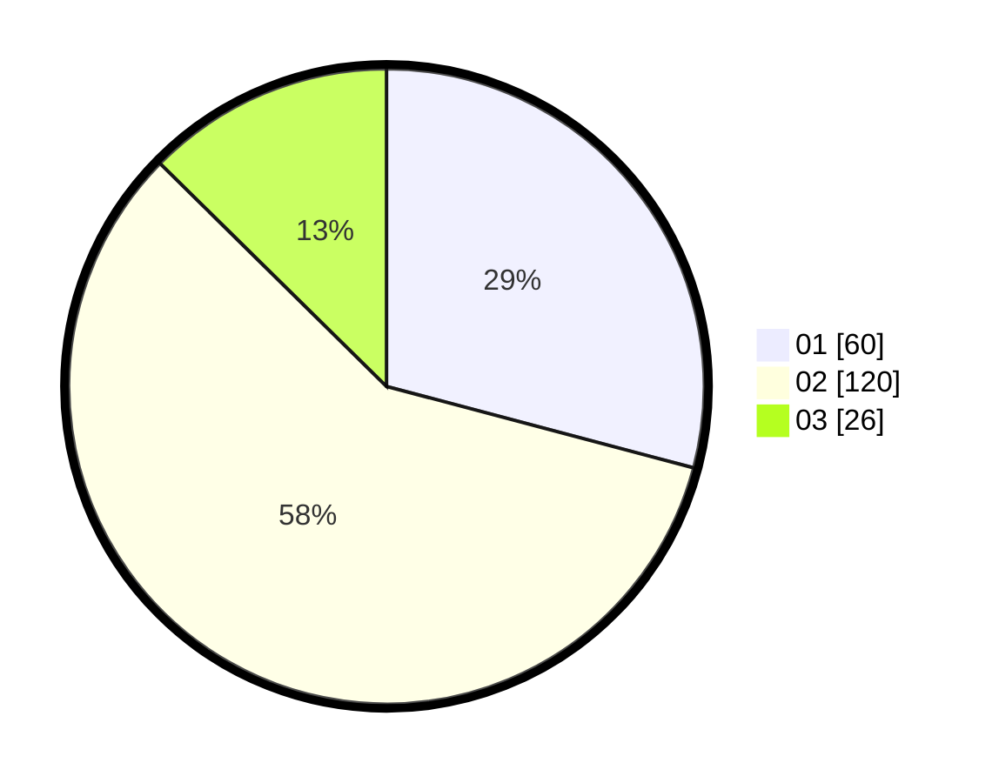

# Hasil

Hasil perolehan suara paslon dapat dilihat pada file paslon-01.txt, paslon-02.txt, dan paslon-03.txt.

Jika tidak ada, artinya data tersebut belum ada pada SIREKAP.

## Perolehan Suara

 * Paslon 01: **60**.
 * Paslon 02: **120**.
 * Paslon 03: **26**.

## Foto C Plano

https://sirekap-obj-formc.kpu.go.id/0952/pemilu/ppwp/31/73/05/10/04/3173051004043-20240214-213624--0f99a635-f28e-4017-9f75-0a503b58279a.jpg

https://sirekap-obj-formc.kpu.go.id/0952/pemilu/ppwp/31/73/05/10/04/3173051004043-20240214-213852--b999cc90-7c7a-4276-b0ed-a26282cccabe.jpg

https://sirekap-obj-formc.kpu.go.id/0952/pemilu/ppwp/31/73/05/10/04/3173051004043-20240214-213936--96227685-31f0-48a2-bcda-31fadfe96f6b.jpg
