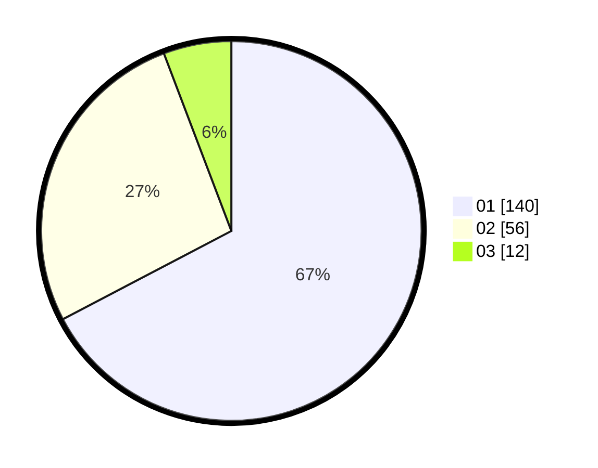

# Hasil

Hasil perolehan suara paslon dapat dilihat pada file paslon-01.txt, paslon-02.txt, dan paslon-03.txt.

Jika tidak ada, artinya data tersebut belum ada pada SIREKAP.

## Perolehan Suara

 * Paslon 01: **140**.
 * Paslon 02: **56**.
 * Paslon 03: **12**.

## Foto C Plano

https://sirekap-obj-formc.kpu.go.id/3412/pemilu/ppwp/31/73/05/10/04/3173051004048-20240214-223648--eef668dd-b408-4f4c-bbc2-c715dccafe8b.jpg

https://sirekap-obj-formc.kpu.go.id/3412/pemilu/ppwp/31/73/05/10/04/3173051004048-20240214-223900--a6ac904e-700b-4cfb-a674-680cac7ae51d.jpg

https://sirekap-obj-formc.kpu.go.id/3412/pemilu/ppwp/31/73/05/10/04/3173051004048-20240214-224112--1821b627-1936-4871-b253-605bbbdccd5b.jpg

## DATA PEMILIH TETAP

Jumlah pemilih dalam DPT: **232**.
 * L: **112**.
 * P: **120**.

## DATA PENGGUNA HAK PILIH

Jumlah pengguna hak pilih dalam DPT: **205**.
 * L: **98**.
 * P: **107**.

Jumlah pengguna hak pilih dalam DPTb: **0**.
 * L: **0**.
 * P: **0**.

Jumlah pengguna hak pilih dalam DPK: **3**.
 * L: **2**.
 * P: **1**.

Jumlah pengguna hak pilih: **208**.
 * L: **100**.
 * P: **108**.

## JUMLAH SUARA SAH DAN TIDAK SAH

JUMLAH SELURUH SUARA SAH: **208**.

JUMLAH SUARA TIDAK SAH: **0**.

JUMLAH SELURUH SUARA SAH DAN SUARA TIDAK SAH: **208**.
