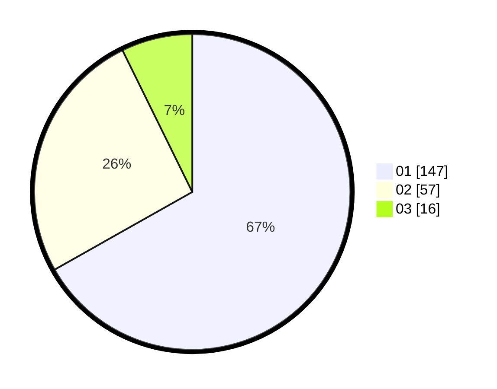

# Hasil

Hasil perolehan suara paslon dapat dilihat pada file paslon-01.txt, paslon-02.txt, dan paslon-03.txt.

Jika tidak ada, artinya data tersebut belum ada pada SIREKAP.

## Perolehan Suara

 * Paslon 01: **147**.
 * Paslon 02: **57**.
 * Paslon 03: **16**.

## Foto C Plano

https://sirekap-obj-formc.kpu.go.id/c25c/pemilu/ppwp/31/73/05/10/04/3173051004054-20240214-201904--9d4199c6-a06c-4a9f-b6f3-9521b373c75f.jpg

https://sirekap-obj-formc.kpu.go.id/c25c/pemilu/ppwp/31/73/05/10/04/3173051004054-20240214-195942--e971658d-e5d4-4d3a-b72a-d27466e87307.jpg

https://sirekap-obj-formc.kpu.go.id/c25c/pemilu/ppwp/31/73/05/10/04/3173051004054-20240214-200327--0041102b-19da-4afa-bdf7-2aa7c5c5b7cb.jpg

## DATA PEMILIH TETAP

Jumlah pemilih dalam DPT: **270**.
 * L: **136**.
 * P: **134**.

## DATA PENGGUNA HAK PILIH

Jumlah pengguna hak pilih dalam DPT: **218**.
 * L: **109**.
 * P: **109**.

Jumlah pengguna hak pilih dalam DPTb: **3**.
 * L: **0**.
 * P: **3**.

Jumlah pengguna hak pilih dalam DPK: **0**.
 * L: **0**.
 * P: **0**.

Jumlah pengguna hak pilih: **221**.
 * L: **109**.
 * P: **112**.

## JUMLAH SUARA SAH DAN TIDAK SAH

JUMLAH SELURUH SUARA SAH: **220**.

JUMLAH SUARA TIDAK SAH: **1**.

JUMLAH SELURUH SUARA SAH DAN SUARA TIDAK SAH: **221**.
