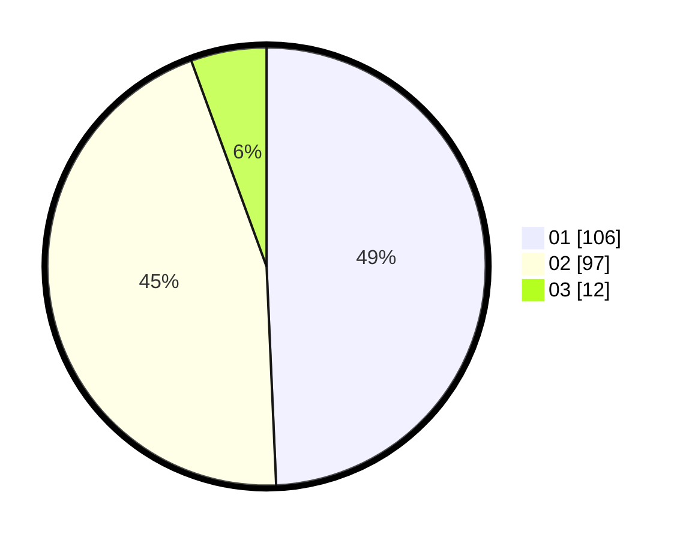

# Hasil

Hasil perolehan suara paslon dapat dilihat pada file paslon-01.txt, paslon-02.txt, dan paslon-03.txt.

Jika tidak ada, artinya data tersebut belum ada pada SIREKAP.

## Perolehan Suara

 * Paslon 01: **106**.
 * Paslon 02: **97**.
 * Paslon 03: **12**.

## Foto C Plano

https://sirekap-obj-formc.kpu.go.id/69b3/pemilu/ppwp/31/73/05/10/04/3173051004056-20240215-024417--c5bbd3b3-6c14-4633-8328-ba335fd8d022.jpg

https://sirekap-obj-formc.kpu.go.id/69b3/pemilu/ppwp/31/73/05/10/04/3173051004056-20240215-024557--94129634-5f6e-4729-bbe0-52876bb93d34.jpg

https://sirekap-obj-formc.kpu.go.id/69b3/pemilu/ppwp/31/73/05/10/04/3173051004056-20240215-024721--a1f66d2e-3084-406a-9527-3f74de560046.jpg
