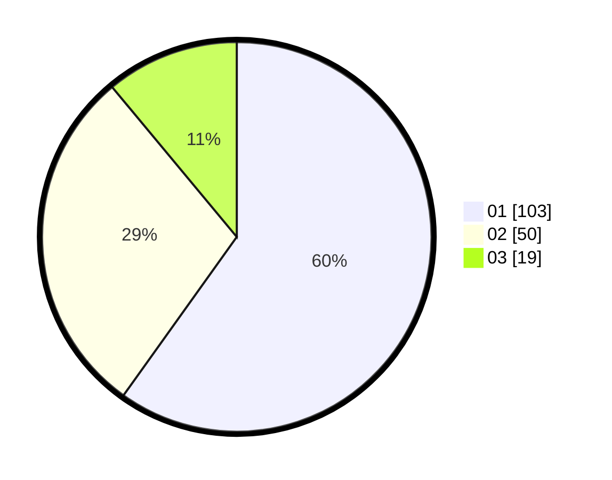

# Hasil

Hasil perolehan suara paslon dapat dilihat pada file paslon-01.txt, paslon-02.txt, dan paslon-03.txt.

Jika tidak ada, artinya data tersebut belum ada pada SIREKAP.

## Perolehan Suara

 * Paslon 01: **103**.
 * Paslon 02: **50**.
 * Paslon 03: **19**.

## Foto C Plano

https://sirekap-obj-formc.kpu.go.id/1884/pemilu/ppwp/31/73/05/10/04/3173051004057-20240215-003259--7a4817b7-7453-4374-ab26-e2ae2c5cff45.jpg

https://sirekap-obj-formc.kpu.go.id/1884/pemilu/ppwp/31/73/05/10/04/3173051004057-20240215-003325--b534c800-332e-486e-b010-31c75b21f865.jpg

https://sirekap-obj-formc.kpu.go.id/1884/pemilu/ppwp/31/73/05/10/04/3173051004057-20240215-014628--012dda6c-cfc6-41b0-8abb-9d84eb54675a.jpg
