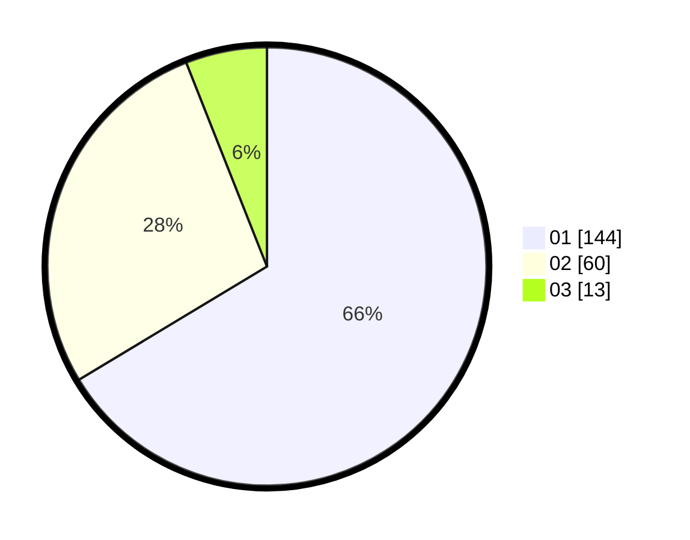

# Hasil

Hasil perolehan suara paslon dapat dilihat pada file paslon-01.txt, paslon-02.txt, dan paslon-03.txt.

Jika tidak ada, artinya data tersebut belum ada pada SIREKAP.

## Perolehan Suara

 * Paslon 01: **144**.
 * Paslon 02: **60**.
 * Paslon 03: **13**.

## Foto C Plano

https://sirekap-obj-formc.kpu.go.id/9006/pemilu/ppwp/31/73/05/10/04/3173051004063-20240214-195208--db858e4e-3332-43d0-bbd6-2bc7bb4da0ef.jpg

https://sirekap-obj-formc.kpu.go.id/9006/pemilu/ppwp/31/73/05/10/04/3173051004063-20240214-201255--5885df8e-3425-4fa8-8337-760f83b279d9.jpg

https://sirekap-obj-formc.kpu.go.id/9006/pemilu/ppwp/31/73/05/10/04/3173051004063-20240214-201439--617838ff-a541-4b03-9cd3-1f476c2432a1.jpg
