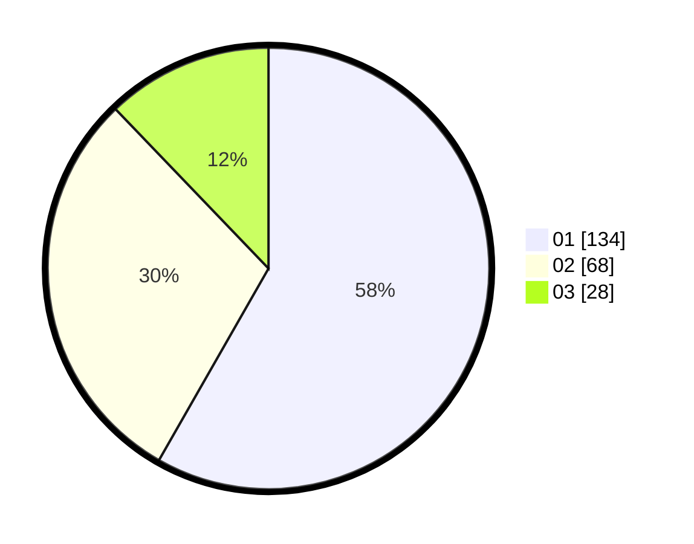

# Hasil

Hasil perolehan suara paslon dapat dilihat pada file paslon-01.txt, paslon-02.txt, dan paslon-03.txt.

Jika tidak ada, artinya data tersebut belum ada pada SIREKAP.

## Perolehan Suara

 * Paslon 01: **134**.
 * Paslon 02: **68**.
 * Paslon 03: **28**.

## Foto C Plano

https://sirekap-obj-formc.kpu.go.id/09ad/pemilu/ppwp/31/73/05/10/04/3173051004068-20240214-225944--d94d7004-bc37-48cc-83c5-e307f7794bfb.jpg

https://sirekap-obj-formc.kpu.go.id/09ad/pemilu/ppwp/31/73/05/10/04/3173051004068-20240214-230124--b9affdaa-f844-421c-8e72-27a26ce6f353.jpg

https://sirekap-obj-formc.kpu.go.id/09ad/pemilu/ppwp/31/73/05/10/04/3173051004068-20240214-230436--dc6c6cb4-bf19-4cdf-a65e-3ab4a4a0f4dd.jpg

## DATA PEMILIH TETAP

Jumlah pemilih dalam DPT: **265**.
 * L: **128**.
 * P: **137**.

## DATA PENGGUNA HAK PILIH

Jumlah pengguna hak pilih dalam DPT: **223**.
 * L: **105**.
 * P: **118**.

Jumlah pengguna hak pilih dalam DPTb: **7**.
 * L: **3**.
 * P: **4**.

Jumlah pengguna hak pilih dalam DPK: **3**.
 * L: **2**.
 * P: **1**.

Jumlah pengguna hak pilih: **233**.
 * L: **110**.
 * P: **123**.

## JUMLAH SUARA SAH DAN TIDAK SAH

JUMLAH SELURUH SUARA SAH: **230**.

JUMLAH SUARA TIDAK SAH: **3**.

JUMLAH SELURUH SUARA SAH DAN SUARA TIDAK SAH: **233**.
