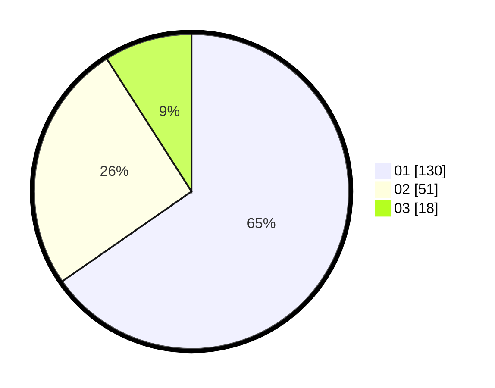

# Hasil

Hasil perolehan suara paslon dapat dilihat pada file paslon-01.txt, paslon-02.txt, dan paslon-03.txt.

Jika tidak ada, artinya data tersebut belum ada pada SIREKAP.

## Perolehan Suara

 * Paslon 01: **130**.
 * Paslon 02: **51**.
 * Paslon 03: **18**.

## Foto C Plano

https://sirekap-obj-formc.kpu.go.id/981f/pemilu/ppwp/31/73/05/10/04/3173051004069-20240215-001524--aa6e9138-a417-4030-871c-2f4c8d7aca6a.jpg

https://sirekap-obj-formc.kpu.go.id/981f/pemilu/ppwp/31/73/05/10/04/3173051004069-20240215-001807--c37ac2de-3716-4413-9d7d-240e7080511b.jpg

https://sirekap-obj-formc.kpu.go.id/981f/pemilu/ppwp/31/73/05/10/04/3173051004069-20240215-002033--197bd090-a6b2-4738-94c8-0c4e3eb8e7c2.jpg
