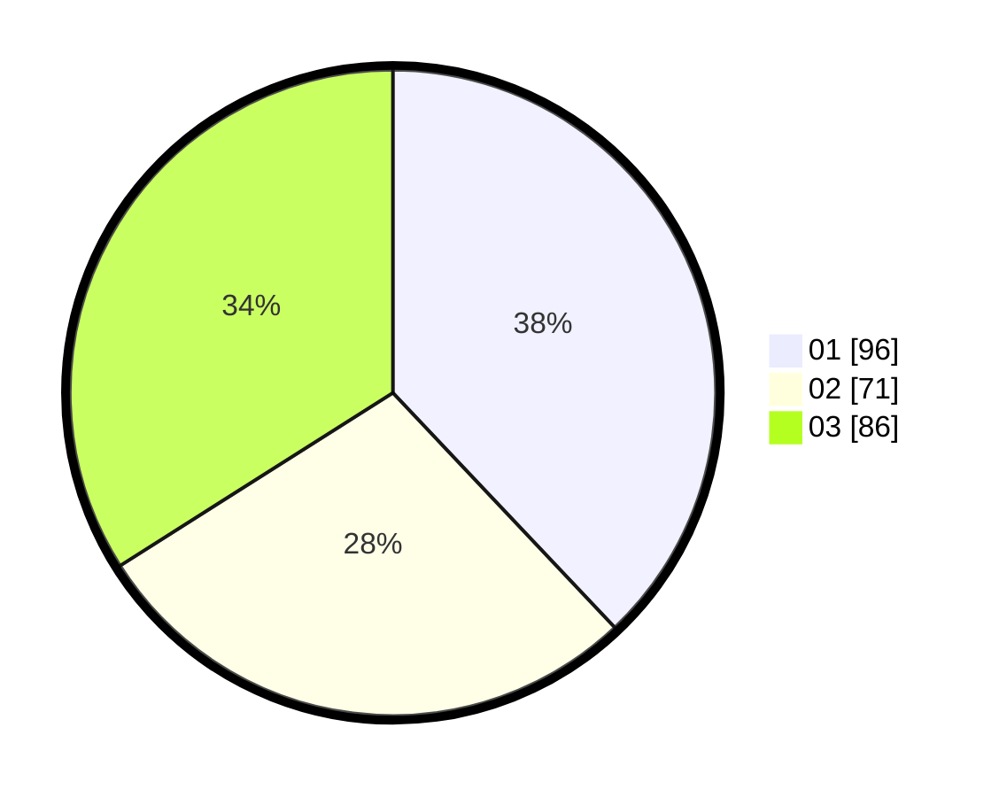

# Hasil

Hasil perolehan suara paslon dapat dilihat pada file paslon-01.txt, paslon-02.txt, dan paslon-03.txt.

Jika tidak ada, artinya data tersebut belum ada pada SIREKAP.

## Perolehan Suara

 * Paslon 01: **96**.
 * Paslon 02: **71**.
 * Paslon 03: **86**.

## Foto C Plano

https://sirekap-obj-formc.kpu.go.id/6fb3/pemilu/ppwp/31/73/05/10/04/3173051004070-20240214-200823--53203571-21c7-411b-a41e-799016298f3c.jpg

https://sirekap-obj-formc.kpu.go.id/6fb3/pemilu/ppwp/31/73/05/10/04/3173051004070-20240214-201033--1722e0f4-4b9a-4d9d-a682-c95f701ccf30.jpg

https://sirekap-obj-formc.kpu.go.id/6fb3/pemilu/ppwp/31/73/05/10/04/3173051004070-20240214-201313--67173bf0-b880-42fe-8311-ef8ea8093470.jpg
