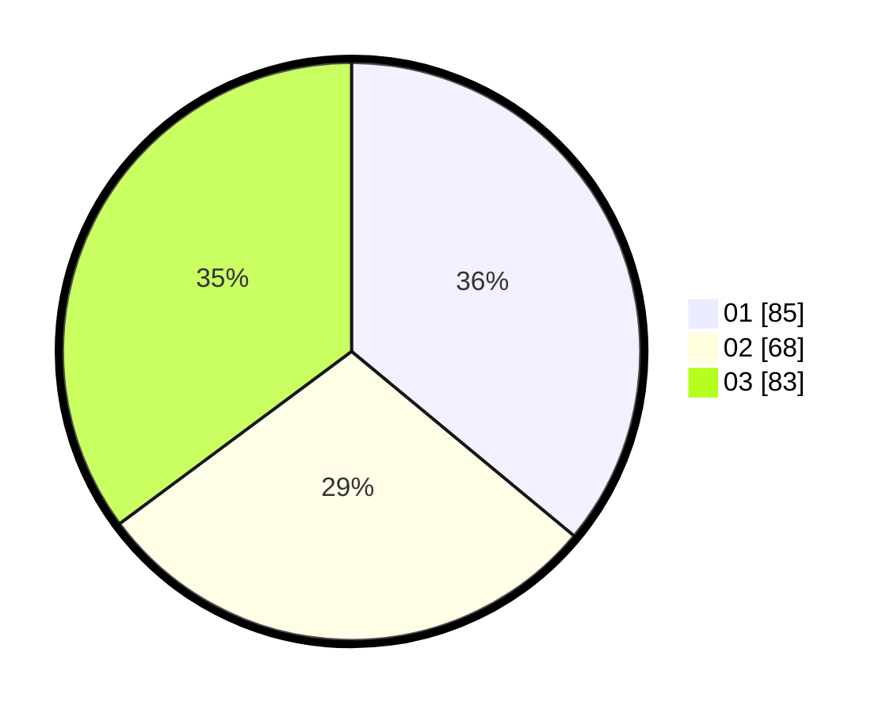

# Hasil

Hasil perolehan suara paslon dapat dilihat pada file paslon-01.txt, paslon-02.txt, dan paslon-03.txt.

Jika tidak ada, artinya data tersebut belum ada pada SIREKAP.

## Perolehan Suara

 * Paslon 01: **85**.
 * Paslon 02: **68**.
 * Paslon 03: **83**.

## Foto C Plano

https://sirekap-obj-formc.kpu.go.id/71a1/pemilu/ppwp/31/73/05/10/04/3173051004072-20240214-215445--ec52142f-afb6-4920-a07a-af46af9746c7.jpg

https://sirekap-obj-formc.kpu.go.id/71a1/pemilu/ppwp/31/73/05/10/04/3173051004072-20240214-215219--621b4351-764b-47ec-b22b-00d620722e15.jpg

https://sirekap-obj-formc.kpu.go.id/71a1/pemilu/ppwp/31/73/05/10/04/3173051004072-20240214-215335--fa10d052-7e85-417f-8087-281772d398b2.jpg
