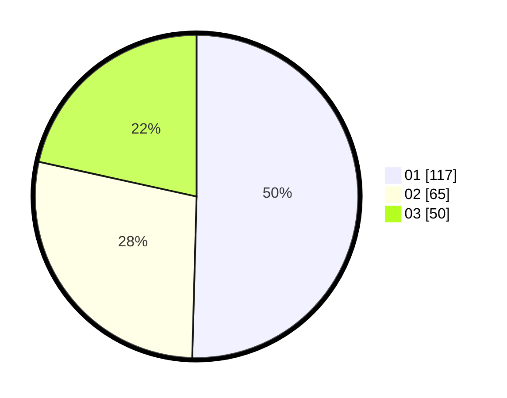

# Hasil

Hasil perolehan suara paslon dapat dilihat pada file paslon-01.txt, paslon-02.txt, dan paslon-03.txt.

Jika tidak ada, artinya data tersebut belum ada pada SIREKAP.

## Perolehan Suara

 * Paslon 01: **117**.
 * Paslon 02: **65**.
 * Paslon 03: **50**.

## Foto C Plano

https://sirekap-obj-formc.kpu.go.id/e64a/pemilu/ppwp/31/73/05/10/04/3173051004073-20240214-213812--e703b283-ec14-476f-a012-e42538224ad0.jpg

https://sirekap-obj-formc.kpu.go.id/e64a/pemilu/ppwp/31/73/05/10/04/3173051004073-20240214-213656--6c5a21f8-fe1d-4837-857c-7d2c8ad4068f.jpg

https://sirekap-obj-formc.kpu.go.id/e64a/pemilu/ppwp/31/73/05/10/04/3173051004073-20240214-213728--210abefa-0fbb-4e28-8ba9-738ff75e9296.jpg
