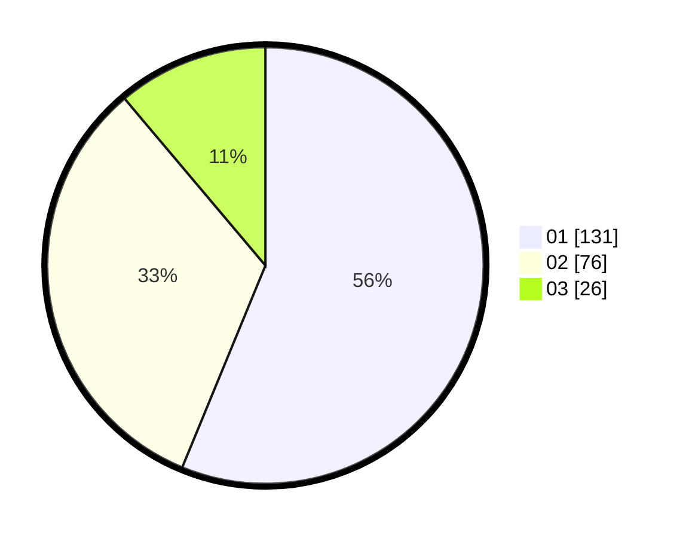

# Hasil

Hasil perolehan suara paslon dapat dilihat pada file paslon-01.txt, paslon-02.txt, dan paslon-03.txt.

Jika tidak ada, artinya data tersebut belum ada pada SIREKAP.

## Perolehan Suara

 * Paslon 01: **131**.
 * Paslon 02: **76**.
 * Paslon 03: **26**.

## Foto C Plano

https://sirekap-obj-formc.kpu.go.id/d129/pemilu/ppwp/31/73/05/10/04/3173051004074-20240214-201628--1d490a12-dfec-4688-8850-ba15d5df9192.jpg

https://sirekap-obj-formc.kpu.go.id/d129/pemilu/ppwp/31/73/05/10/04/3173051004074-20240214-201805--3407e1bc-42d5-4d4b-9093-f815f0792930.jpg

https://sirekap-obj-formc.kpu.go.id/d129/pemilu/ppwp/31/73/05/10/04/3173051004074-20240214-201907--abd71f97-5710-4075-8702-2ea0be8b96c4.jpg

## DATA PEMILIH TETAP

Jumlah pemilih dalam DPT: **281**.
 * L: **134**.
 * P: **147**.

## DATA PENGGUNA HAK PILIH

Jumlah pengguna hak pilih dalam DPT: **228**.
 * L: **104**.
 * P: **124**.

Jumlah pengguna hak pilih dalam DPTb: **5**.
 * L: **1**.
 * P: **4**.

Jumlah pengguna hak pilih dalam DPK: **3**.
 * L: **2**.
 * P: **1**.

Jumlah pengguna hak pilih: **236**.
 * L: **107**.
 * P: **129**.

## JUMLAH SUARA SAH DAN TIDAK SAH

JUMLAH SELURUH SUARA SAH: **233**.

JUMLAH SUARA TIDAK SAH: **3**.

JUMLAH SELURUH SUARA SAH DAN SUARA TIDAK SAH: **236**.
