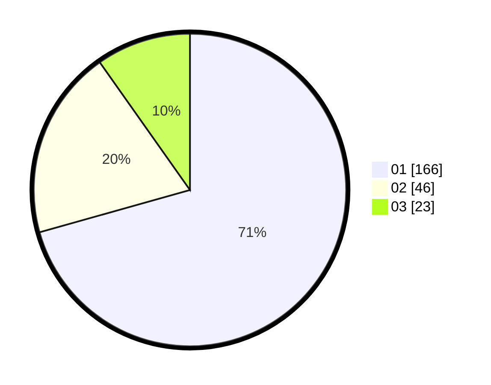

# Hasil

Hasil perolehan suara paslon dapat dilihat pada file paslon-01.txt, paslon-02.txt, dan paslon-03.txt.

Jika tidak ada, artinya data tersebut belum ada pada SIREKAP.

## Perolehan Suara

 * Paslon 01: **166**.
 * Paslon 02: **46**.
 * Paslon 03: **23**.

## Foto C Plano

https://sirekap-obj-formc.kpu.go.id/283b/pemilu/ppwp/31/73/05/10/04/3173051004078-20240215-000457--6fe92a28-8338-42c3-a34f-f966ea49a178.jpg

https://sirekap-obj-formc.kpu.go.id/283b/pemilu/ppwp/31/73/05/10/04/3173051004078-20240215-000720--f36cf36a-616a-44f5-ae5b-f8845c869db6.jpg

https://sirekap-obj-formc.kpu.go.id/283b/pemilu/ppwp/31/73/05/10/04/3173051004078-20240215-000810--989b95d9-a3f2-4dda-a579-4d018f41b383.jpg
