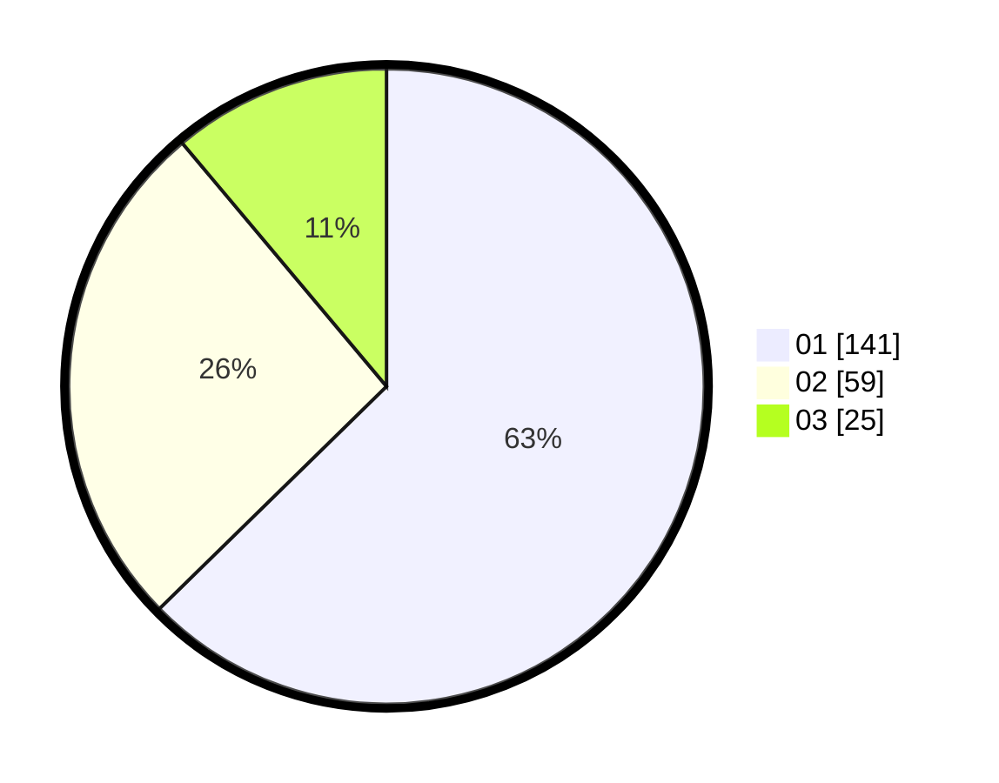

# Hasil

Hasil perolehan suara paslon dapat dilihat pada file paslon-01.txt, paslon-02.txt, dan paslon-03.txt.

Jika tidak ada, artinya data tersebut belum ada pada SIREKAP.

## Perolehan Suara

 * Paslon 01: **141**.
 * Paslon 02: **59**.
 * Paslon 03: **25**.

## Foto C Plano

https://sirekap-obj-formc.kpu.go.id/53be/pemilu/ppwp/31/73/05/10/05/3173051005009-20240215-000220--2c86212a-644a-4491-891c-4a4668d4a398.jpg

https://sirekap-obj-formc.kpu.go.id/53be/pemilu/ppwp/31/73/05/10/05/3173051005009-20240215-000344--59acb6c8-dd1d-46ce-a83e-8ee00f8a691a.jpg

https://sirekap-obj-formc.kpu.go.id/53be/pemilu/ppwp/31/73/05/10/05/3173051005009-20240215-000452--36c320df-5f5b-4e99-855f-4f7bcbbb1319.jpg
