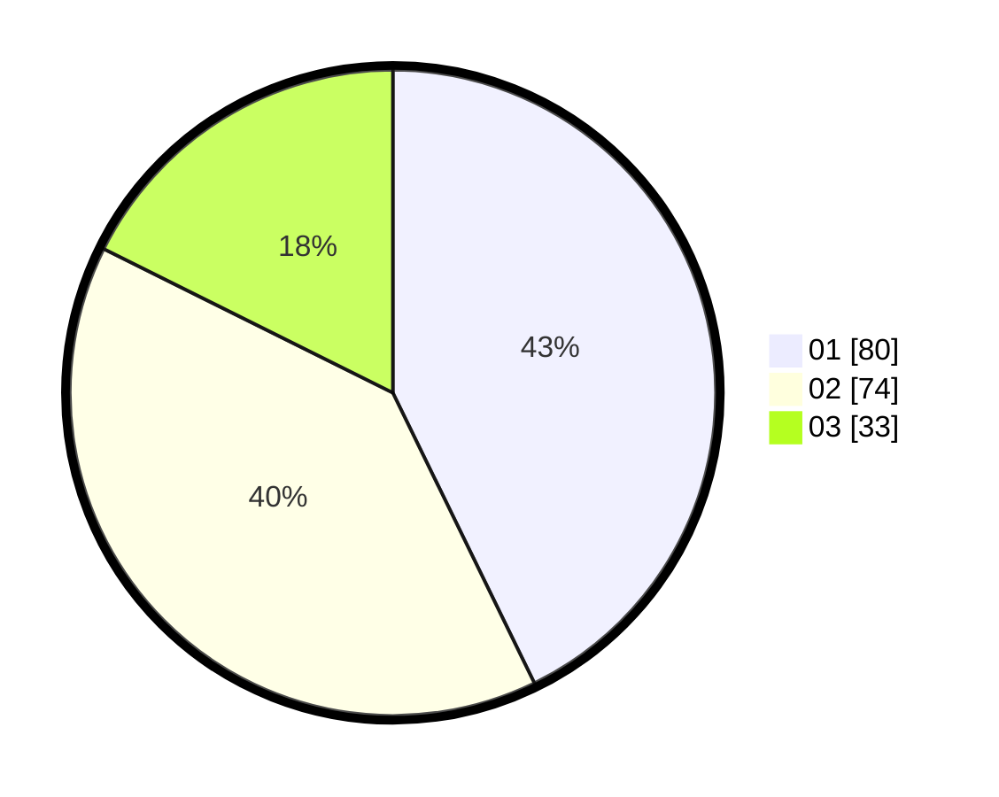

# Hasil

Hasil perolehan suara paslon dapat dilihat pada file paslon-01.txt, paslon-02.txt, dan paslon-03.txt.

Jika tidak ada, artinya data tersebut belum ada pada SIREKAP.

## Perolehan Suara

 * Paslon 01: **80**.
 * Paslon 02: **74**.
 * Paslon 03: **33**.

## Foto C Plano

https://sirekap-obj-formc.kpu.go.id/bbdf/pemilu/ppwp/31/73/05/10/05/3173051005014-20240214-190113--51e5726d-ede6-4cd5-92f3-eb3676485ebe.jpg

https://sirekap-obj-formc.kpu.go.id/bbdf/pemilu/ppwp/31/73/05/10/05/3173051005014-20240214-185640--1efce0ab-8fa7-41bf-82ab-615c027fec37.jpg

https://sirekap-obj-formc.kpu.go.id/bbdf/pemilu/ppwp/31/73/05/10/05/3173051005014-20240214-191716--05aa682c-2cf2-4d10-b970-321faf7c1c1b.jpg

## DATA PEMILIH TETAP

Jumlah pemilih dalam DPT: **247**.
 * L: **123**.
 * P: **124**.

## DATA PENGGUNA HAK PILIH

Jumlah pengguna hak pilih dalam DPT: **174**.
 * L: **87**.
 * P: **87**.

Jumlah pengguna hak pilih dalam DPTb: **6**.
 * L: **2**.
 * P: **4**.

Jumlah pengguna hak pilih dalam DPK: **0**.
 * L: **0**.
 * P: **0**.

Jumlah pengguna hak pilih: **180**.
 * L: **89**.
 * P: **91**.

## JUMLAH SUARA SAH DAN TIDAK SAH

JUMLAH SELURUH SUARA SAH: **177**.

JUMLAH SUARA TIDAK SAH: **3**.

JUMLAH SELURUH SUARA SAH DAN SUARA TIDAK SAH: **180**.
