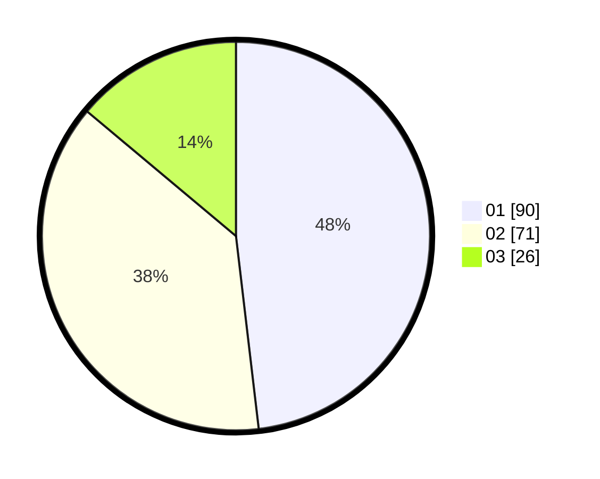

# Hasil

Hasil perolehan suara paslon dapat dilihat pada file paslon-01.txt, paslon-02.txt, dan paslon-03.txt.

Jika tidak ada, artinya data tersebut belum ada pada SIREKAP.

## Perolehan Suara

 * Paslon 01: **90**.
 * Paslon 02: **71**.
 * Paslon 03: **26**.

## Foto C Plano

https://sirekap-obj-formc.kpu.go.id/f313/pemilu/ppwp/31/73/05/10/05/3173051005015-20240214-202945--7b01d28b-fe1d-4c77-8fe3-e532def9dccf.jpg

https://sirekap-obj-formc.kpu.go.id/f313/pemilu/ppwp/31/73/05/10/05/3173051005015-20240214-221550--4dba417d-b0a5-42c9-9265-33609e3398c9.jpg

https://sirekap-obj-formc.kpu.go.id/f313/pemilu/ppwp/31/73/05/10/05/3173051005015-20240214-203428--80adf935-aff2-42a2-bcc6-394f34c8089b.jpg

## DATA PEMILIH TETAP

Jumlah pemilih dalam DPT: **249**.
 * L: **131**.
 * P: **118**.

## DATA PENGGUNA HAK PILIH

Jumlah pengguna hak pilih dalam DPT: **184**.
 * L: **97**.
 * P: **87**.

Jumlah pengguna hak pilih dalam DPTb: **4**.
 * L: **1**.
 * P: **3**.

Jumlah pengguna hak pilih dalam DPK: **3**.
 * L: **2**.
 * P: **1**.

Jumlah pengguna hak pilih: **191**.
 * L: **100**.
 * P: **91**.

## JUMLAH SUARA SAH DAN TIDAK SAH

JUMLAH SELURUH SUARA SAH: **187**.

JUMLAH SUARA TIDAK SAH: **4**.

JUMLAH SELURUH SUARA SAH DAN SUARA TIDAK SAH: **191**.
