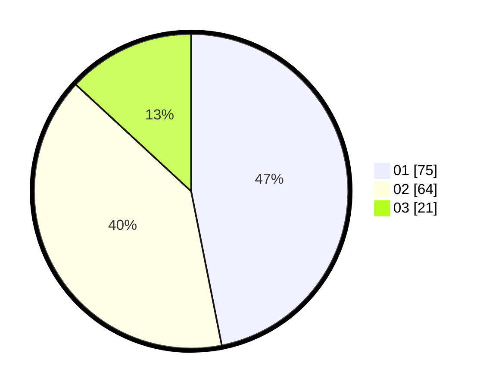

# Hasil

Hasil perolehan suara paslon dapat dilihat pada file paslon-01.txt, paslon-02.txt, dan paslon-03.txt.

Jika tidak ada, artinya data tersebut belum ada pada SIREKAP.

## Perolehan Suara

 * Paslon 01: **75**.
 * Paslon 02: **64**.
 * Paslon 03: **21**.

## Foto C Plano

https://sirekap-obj-formc.kpu.go.id/9249/pemilu/ppwp/31/73/05/10/05/3173051005016-20240214-192041--d9ff55e6-1df3-4ace-aea6-81a726a5c7f7.jpg

https://sirekap-obj-formc.kpu.go.id/9249/pemilu/ppwp/31/73/05/10/05/3173051005016-20240214-193809--7461661d-557c-4b50-9bc1-90b64fe2af97.jpg

https://sirekap-obj-formc.kpu.go.id/9249/pemilu/ppwp/31/73/05/10/05/3173051005016-20240214-191931--fbc4118a-fcff-47d4-ab72-a98cdc00d99b.jpg

## DATA PEMILIH TETAP

Jumlah pemilih dalam DPT: **233**.
 * L: **114**.
 * P: **119**.

## DATA PENGGUNA HAK PILIH

Jumlah pengguna hak pilih dalam DPT: **154**.
 * L: **76**.
 * P: **78**.

Jumlah pengguna hak pilih dalam DPTb: **5**.
 * L: **3**.
 * P: **2**.

Jumlah pengguna hak pilih dalam DPK: **2**.
 * L: **2**.
 * P: **0**.

Jumlah pengguna hak pilih: **161**.
 * L: **81**.
 * P: **80**.

## JUMLAH SUARA SAH DAN TIDAK SAH

JUMLAH SELURUH SUARA SAH: **160**.

JUMLAH SUARA TIDAK SAH: **1**.

JUMLAH SELURUH SUARA SAH DAN SUARA TIDAK SAH: **161**.
