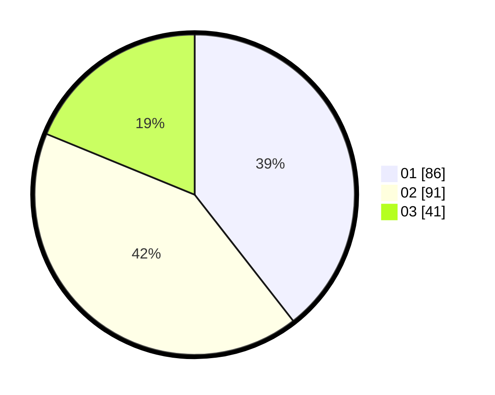

# Hasil

Hasil perolehan suara paslon dapat dilihat pada file paslon-01.txt, paslon-02.txt, dan paslon-03.txt.

Jika tidak ada, artinya data tersebut belum ada pada SIREKAP.

## Perolehan Suara

 * Paslon 01: **86**.
 * Paslon 02: **91**.
 * Paslon 03: **41**.

## Foto C Plano

https://sirekap-obj-formc.kpu.go.id/fdcf/pemilu/ppwp/31/73/05/10/05/3173051005017-20240214-155242--f43970c9-8005-4d10-baab-97bf7b2f3bc8.jpg

https://sirekap-obj-formc.kpu.go.id/fdcf/pemilu/ppwp/31/73/05/10/05/3173051005017-20240214-155540--0d7af86c-f981-44b4-a000-90f184e030b1.jpg

https://sirekap-obj-formc.kpu.go.id/fdcf/pemilu/ppwp/31/73/05/10/05/3173051005017-20240214-155747--eb8c2ec4-6d87-4b9c-b62d-14ba041ad7ec.jpg

## DATA PEMILIH TETAP

Jumlah pemilih dalam DPT: **278**.
 * L: **140**.
 * P: **138**.

## DATA PENGGUNA HAK PILIH

Jumlah pengguna hak pilih dalam DPT: **203**.
 * L: **106**.
 * P: **97**.

Jumlah pengguna hak pilih dalam DPTb: **13**.
 * L: **4**.
 * P: **9**.

Jumlah pengguna hak pilih dalam DPK: **4**.
 * L: **3**.
 * P: **1**.

Jumlah pengguna hak pilih: **220**.
 * L: **113**.
 * P: **107**.

## JUMLAH SUARA SAH DAN TIDAK SAH

JUMLAH SELURUH SUARA SAH: **218**.

JUMLAH SUARA TIDAK SAH: **2**.

JUMLAH SELURUH SUARA SAH DAN SUARA TIDAK SAH: **220**.
