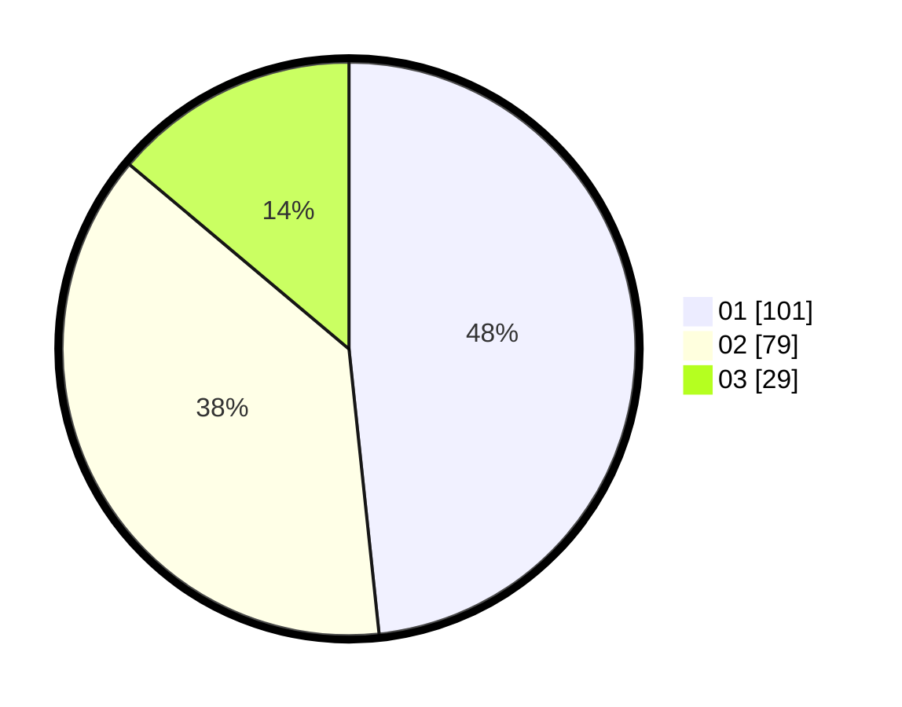

# Hasil

Hasil perolehan suara paslon dapat dilihat pada file paslon-01.txt, paslon-02.txt, dan paslon-03.txt.

Jika tidak ada, artinya data tersebut belum ada pada SIREKAP.

## Perolehan Suara

 * Paslon 01: **101**.
 * Paslon 02: **79**.
 * Paslon 03: **29**.

## Foto C Plano

https://sirekap-obj-formc.kpu.go.id/15be/pemilu/ppwp/31/73/05/10/05/3173051005018-20240214-202459--6edae271-fe48-405c-a944-16f81478b762.jpg

https://sirekap-obj-formc.kpu.go.id/15be/pemilu/ppwp/31/73/05/10/05/3173051005018-20240217-221307--f77c3fbc-2b40-4868-857a-c72bff7e6529.jpg

https://sirekap-obj-formc.kpu.go.id/15be/pemilu/ppwp/31/73/05/10/05/3173051005018-20240217-221433--9a956073-6a24-4949-924e-50b9ca091b60.jpg

## DATA PEMILIH TETAP

Jumlah pemilih dalam DPT: **278**.
 * L: **140**.
 * P: **138**.

## DATA PENGGUNA HAK PILIH

Jumlah pengguna hak pilih dalam DPT: **204**.
 * L: **99**.
 * P: **105**.

Jumlah pengguna hak pilih dalam DPTb: **8**.
 * L: **4**.
 * P: **4**.

Jumlah pengguna hak pilih dalam DPK: **0**.
 * L: **0**.
 * P: **0**.

Jumlah pengguna hak pilih: **212**.
 * L: **103**.
 * P: **109**.

## JUMLAH SUARA SAH DAN TIDAK SAH

JUMLAH SELURUH SUARA SAH: **209**.

JUMLAH SUARA TIDAK SAH: **3**.

JUMLAH SELURUH SUARA SAH DAN SUARA TIDAK SAH: **212**.
