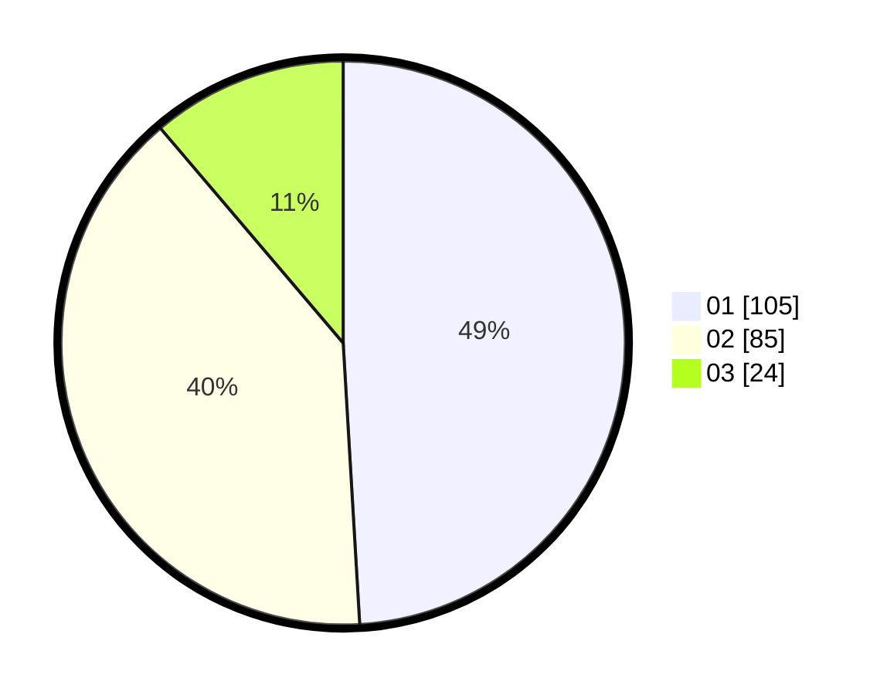

# Hasil

Hasil perolehan suara paslon dapat dilihat pada file paslon-01.txt, paslon-02.txt, dan paslon-03.txt.

Jika tidak ada, artinya data tersebut belum ada pada SIREKAP.

## Perolehan Suara

 * Paslon 01: **105**.
 * Paslon 02: **85**.
 * Paslon 03: **24**.

## Foto C Plano

https://sirekap-obj-formc.kpu.go.id/145d/pemilu/ppwp/31/73/05/10/05/3173051005019-20240217-010402--41d948cc-f02b-49bf-ba71-581060ebfe61.jpg

https://sirekap-obj-formc.kpu.go.id/145d/pemilu/ppwp/31/73/05/10/05/3173051005019-20240217-010403--ff235d9e-7f05-4b6d-9ea1-4c0d85d565be.jpg

https://sirekap-obj-formc.kpu.go.id/145d/pemilu/ppwp/31/73/05/10/05/3173051005019-20240217-010403--32016d02-97e7-449e-96a2-a1aecc55e72a.jpg

## DATA PEMILIH TETAP

Jumlah pemilih dalam DPT: **279**.
 * L: **140**.
 * P: **139**.

## DATA PENGGUNA HAK PILIH

Jumlah pengguna hak pilih dalam DPT: **202**.
 * L: **99**.
 * P: **103**.

Jumlah pengguna hak pilih dalam DPTb: **12**.
 * L: **4**.
 * P: **8**.

Jumlah pengguna hak pilih dalam DPK: **3**.
 * L: **2**.
 * P: **1**.

Jumlah pengguna hak pilih: **217**.
 * L: **105**.
 * P: **112**.

## JUMLAH SUARA SAH DAN TIDAK SAH

JUMLAH SELURUH SUARA SAH: **214**.

JUMLAH SUARA TIDAK SAH: **3**.

JUMLAH SELURUH SUARA SAH DAN SUARA TIDAK SAH: **217**.
