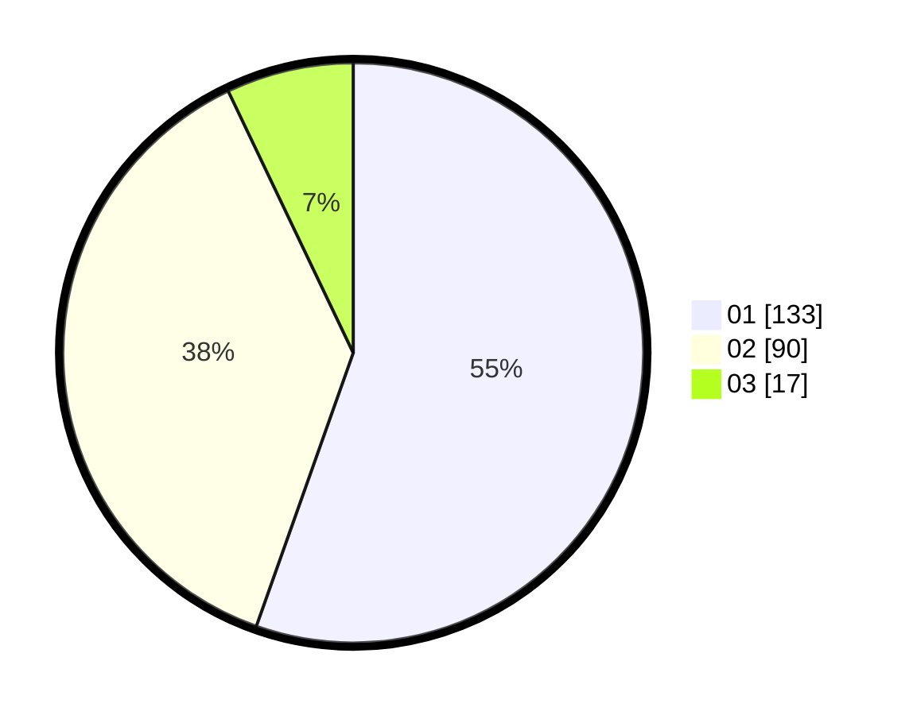

# Hasil

Hasil perolehan suara paslon dapat dilihat pada file paslon-01.txt, paslon-02.txt, dan paslon-03.txt.

Jika tidak ada, artinya data tersebut belum ada pada SIREKAP.

## Perolehan Suara

 * Paslon 01: **133**.
 * Paslon 02: **90**.
 * Paslon 03: **17**.

## Foto C Plano

https://sirekap-obj-formc.kpu.go.id/074b/pemilu/ppwp/31/73/05/10/05/3173051005020-20240214-203650--1adcd972-2e1a-48d8-841f-b52c2ddd98da.jpg

https://sirekap-obj-formc.kpu.go.id/074b/pemilu/ppwp/31/73/05/10/05/3173051005020-20240214-185643--07b24db3-2172-4f88-89bd-5901096ad330.jpg

https://sirekap-obj-formc.kpu.go.id/074b/pemilu/ppwp/31/73/05/10/05/3173051005020-20240214-185809--1bfb478e-2b76-45c3-9dd1-6046c93f1d2c.jpg
