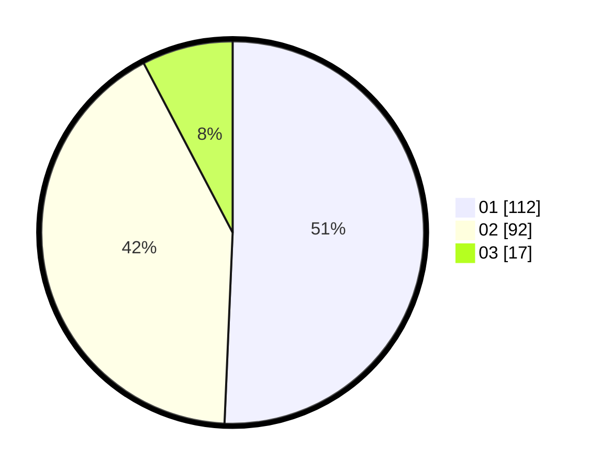

# Hasil

Hasil perolehan suara paslon dapat dilihat pada file paslon-01.txt, paslon-02.txt, dan paslon-03.txt.

Jika tidak ada, artinya data tersebut belum ada pada SIREKAP.

## Perolehan Suara

 * Paslon 01: **112**.
 * Paslon 02: **92**.
 * Paslon 03: **17**.

## Foto C Plano

https://sirekap-obj-formc.kpu.go.id/039d/pemilu/ppwp/31/73/05/10/05/3173051005021-20240214-225021--e15f7251-81bb-4ff9-af74-9e2251dd6361.jpg

https://sirekap-obj-formc.kpu.go.id/039d/pemilu/ppwp/31/73/05/10/05/3173051005021-20240214-230018--497c3e0d-1204-4e3c-9ab8-557fe29308f7.jpg

https://sirekap-obj-formc.kpu.go.id/039d/pemilu/ppwp/31/73/05/10/05/3173051005021-20240214-230125--23a6131f-d106-4ed3-9c70-0adf27cdacc7.jpg
