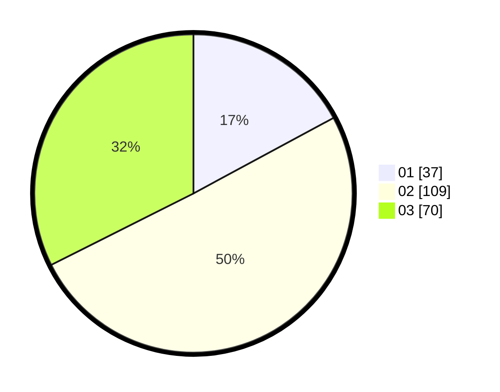

# Hasil

Hasil perolehan suara paslon dapat dilihat pada file paslon-01.txt, paslon-02.txt, dan paslon-03.txt.

Jika tidak ada, artinya data tersebut belum ada pada SIREKAP.

## Perolehan Suara

 * Paslon 01: **37**.
 * Paslon 02: **109**.
 * Paslon 03: **70**.

## Foto C Plano

https://sirekap-obj-formc.kpu.go.id/d4d0/pemilu/ppwp/31/73/05/10/05/3173051005027-20240214-224640--a8c66196-3c9e-409e-a4e7-be8793be70fb.jpg

https://sirekap-obj-formc.kpu.go.id/d4d0/pemilu/ppwp/31/73/05/10/05/3173051005027-20240214-224721--d90a11d6-9b3a-4c1f-9289-fd6839447626.jpg
