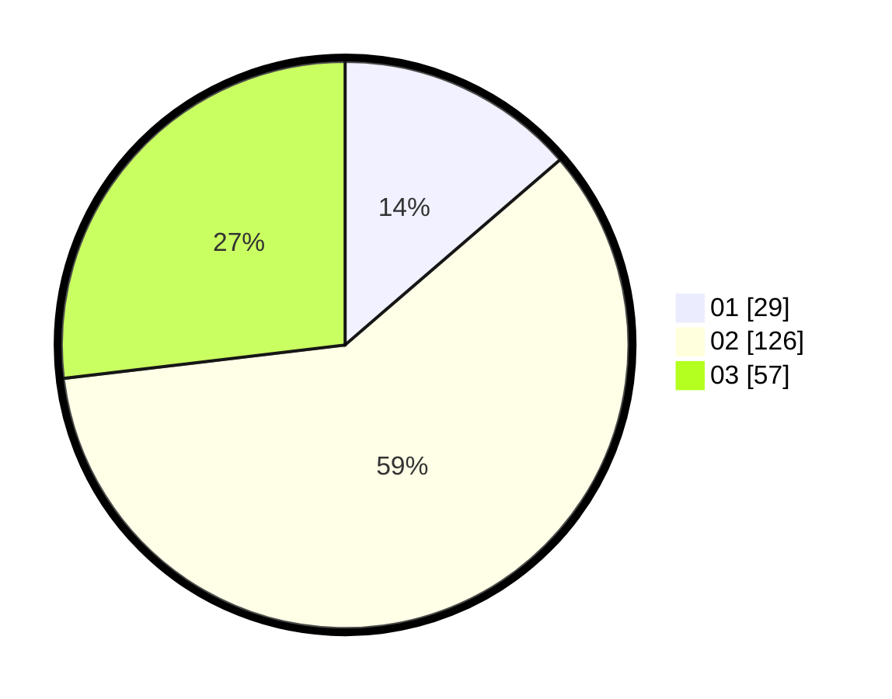

# Hasil

Hasil perolehan suara paslon dapat dilihat pada file paslon-01.txt, paslon-02.txt, dan paslon-03.txt.

Jika tidak ada, artinya data tersebut belum ada pada SIREKAP.

## Perolehan Suara

 * Paslon 01: **29**.
 * Paslon 02: **126**.
 * Paslon 03: **57**.

## Foto C Plano

https://sirekap-obj-formc.kpu.go.id/2576/pemilu/ppwp/31/73/05/10/05/3173051005028-20240214-231442--bb565c64-f54a-48f5-995d-28d2f0a2960a.jpg

https://sirekap-obj-formc.kpu.go.id/2576/pemilu/ppwp/31/73/05/10/05/3173051005028-20240214-231838--9ac4a6e3-69ef-47bf-af90-81e5997e93b9.jpg

https://sirekap-obj-formc.kpu.go.id/2576/pemilu/ppwp/31/73/05/10/05/3173051005028-20240214-232119--eb92bd76-1438-4db0-802c-47e7ddb35000.jpg
