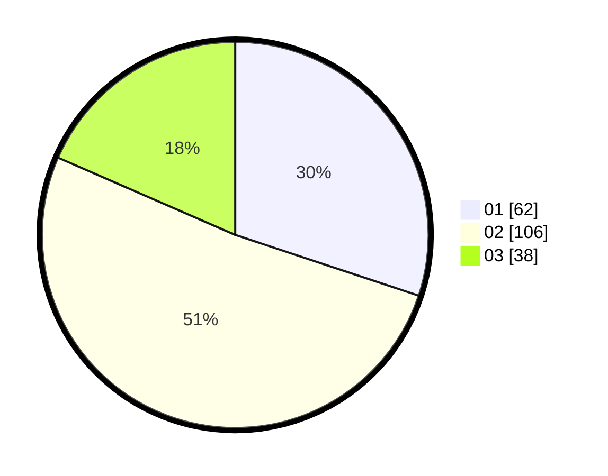

# Hasil

Hasil perolehan suara paslon dapat dilihat pada file paslon-01.txt, paslon-02.txt, dan paslon-03.txt.

Jika tidak ada, artinya data tersebut belum ada pada SIREKAP.

## Perolehan Suara

 * Paslon 01: **62**.
 * Paslon 02: **106**.
 * Paslon 03: **38**.

## Foto C Plano

https://sirekap-obj-formc.kpu.go.id/9268/pemilu/ppwp/31/73/05/10/05/3173051005033-20240215-010526--f1f38d6b-f27b-4418-a5be-455db00747ca.jpg

https://sirekap-obj-formc.kpu.go.id/9268/pemilu/ppwp/31/73/05/10/05/3173051005033-20240214-203120--723adbdd-348b-46dd-9d68-a102f2c676ad.jpg

https://sirekap-obj-formc.kpu.go.id/9268/pemilu/ppwp/31/73/05/10/05/3173051005033-20240214-203351--81c23fca-89fd-4462-ab8c-0c3d387aba0d.jpg

## DATA PEMILIH TETAP

Jumlah pemilih dalam DPT: **280**.
 * L: **146**.
 * P: **134**.

## DATA PENGGUNA HAK PILIH

Jumlah pengguna hak pilih dalam DPT: **188**.
 * L: **95**.
 * P: **93**.

Jumlah pengguna hak pilih dalam DPTb: **17**.
 * L: **3**.
 * P: **14**.

Jumlah pengguna hak pilih dalam DPK: **1**.
 * L: **0**.
 * P: **1**.

Jumlah pengguna hak pilih: **206**.
 * L: **98**.
 * P: **108**.

## JUMLAH SUARA SAH DAN TIDAK SAH

JUMLAH SELURUH SUARA SAH: **206**.

JUMLAH SUARA TIDAK SAH: **0**.

JUMLAH SELURUH SUARA SAH DAN SUARA TIDAK SAH: **206**.
