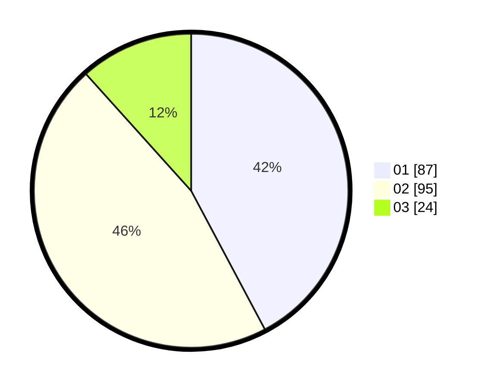

# Hasil

Hasil perolehan suara paslon dapat dilihat pada file paslon-01.txt, paslon-02.txt, dan paslon-03.txt.

Jika tidak ada, artinya data tersebut belum ada pada SIREKAP.

## Perolehan Suara

 * Paslon 01: **87**.
 * Paslon 02: **95**.
 * Paslon 03: **24**.

## Foto C Plano

https://sirekap-obj-formc.kpu.go.id/0c1e/pemilu/ppwp/31/73/05/10/05/3173051005035-20240214-190255--7ee8acb1-55b5-47a5-8802-fd9961099f10.jpg

https://sirekap-obj-formc.kpu.go.id/0c1e/pemilu/ppwp/31/73/05/10/05/3173051005035-20240214-195215--a61fd249-966c-4080-bbab-9e3019eca888.jpg

https://sirekap-obj-formc.kpu.go.id/0c1e/pemilu/ppwp/31/73/05/10/05/3173051005035-20240214-195505--53f84199-e40d-42d7-aeb2-87f532d449c5.jpg

## DATA PEMILIH TETAP

Jumlah pemilih dalam DPT: **258**.
 * L: **133**.
 * P: **125**.

## DATA PENGGUNA HAK PILIH

Jumlah pengguna hak pilih dalam DPT: **199**.
 * L: **97**.
 * P: **102**.

Jumlah pengguna hak pilih dalam DPTb: **7**.
 * L: **3**.
 * P: **4**.

Jumlah pengguna hak pilih dalam DPK: **2**.
 * L: **2**.
 * P: **0**.

Jumlah pengguna hak pilih: **208**.
 * L: **102**.
 * P: **206**.

## JUMLAH SUARA SAH DAN TIDAK SAH

JUMLAH SELURUH SUARA SAH: **206**.

JUMLAH SUARA TIDAK SAH: **2**.

JUMLAH SELURUH SUARA SAH DAN SUARA TIDAK SAH: **208**.
