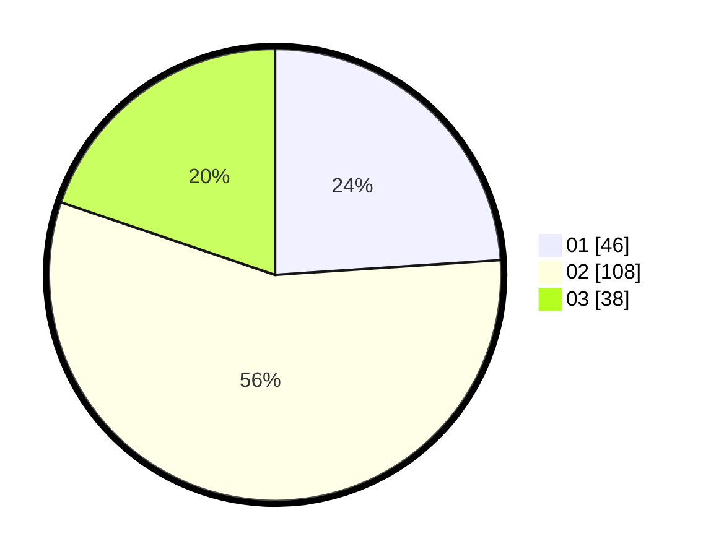

# Hasil

Hasil perolehan suara paslon dapat dilihat pada file paslon-01.txt, paslon-02.txt, dan paslon-03.txt.

Jika tidak ada, artinya data tersebut belum ada pada SIREKAP.

## Perolehan Suara

 * Paslon 01: **46**.
 * Paslon 02: **108**.
 * Paslon 03: **38**.

## Foto C Plano

https://sirekap-obj-formc.kpu.go.id/e01e/pemilu/ppwp/31/73/05/10/05/3173051005038-20240215-014310--2504674b-050d-4102-bdb3-8bbdb11317b3.jpg

https://sirekap-obj-formc.kpu.go.id/e01e/pemilu/ppwp/31/73/05/10/05/3173051005038-20240215-014812--7fb60f14-727f-4ccd-b691-e5aff5f9ab98.jpg

https://sirekap-obj-formc.kpu.go.id/e01e/pemilu/ppwp/31/73/05/10/05/3173051005038-20240215-014859--f19762c9-21cd-41b2-a7ef-6efc7676f8e2.jpg

## DATA PEMILIH TETAP

Jumlah pemilih dalam DPT: **268**.
 * L: **137**.
 * P: **131**.

## DATA PENGGUNA HAK PILIH

Jumlah pengguna hak pilih dalam DPT: **190**.
 * L: **100**.
 * P: **90**.

Jumlah pengguna hak pilih dalam DPTb: **4**.
 * L: **3**.
 * P: **1**.

Jumlah pengguna hak pilih dalam DPK: **1**.
 * L: **0**.
 * P: **1**.

Jumlah pengguna hak pilih: **195**.
 * L: **103**.
 * P: **92**.

## JUMLAH SUARA SAH DAN TIDAK SAH

JUMLAH SELURUH SUARA SAH: **192**.

JUMLAH SUARA TIDAK SAH: **3**.

JUMLAH SELURUH SUARA SAH DAN SUARA TIDAK SAH: **195**.
