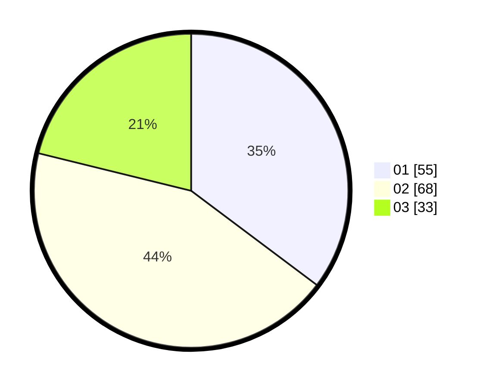

# Hasil

Hasil perolehan suara paslon dapat dilihat pada file paslon-01.txt, paslon-02.txt, dan paslon-03.txt.

Jika tidak ada, artinya data tersebut belum ada pada SIREKAP.

## Perolehan Suara

 * Paslon 01: **55**.
 * Paslon 02: **68**.
 * Paslon 03: **33**.

## Foto C Plano

https://sirekap-obj-formc.kpu.go.id/c196/pemilu/ppwp/31/73/05/10/05/3173051005039-20240214-215521--055acc70-e35e-4612-af02-a589dc60d000.jpg

https://sirekap-obj-formc.kpu.go.id/c196/pemilu/ppwp/31/73/05/10/05/3173051005039-20240214-215526--4ff370fb-ba46-4ad1-a308-35467f07105a.jpg

https://sirekap-obj-formc.kpu.go.id/c196/pemilu/ppwp/31/73/05/10/05/3173051005039-20240214-215529--6844f5bb-cda8-4367-99c3-200a9f2bc8a3.jpg
